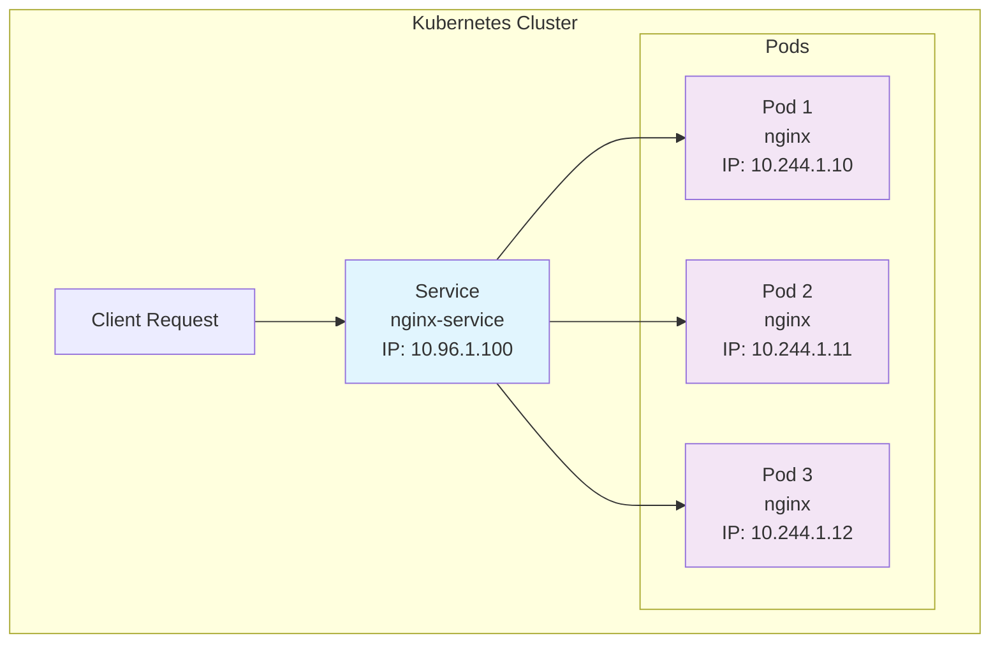
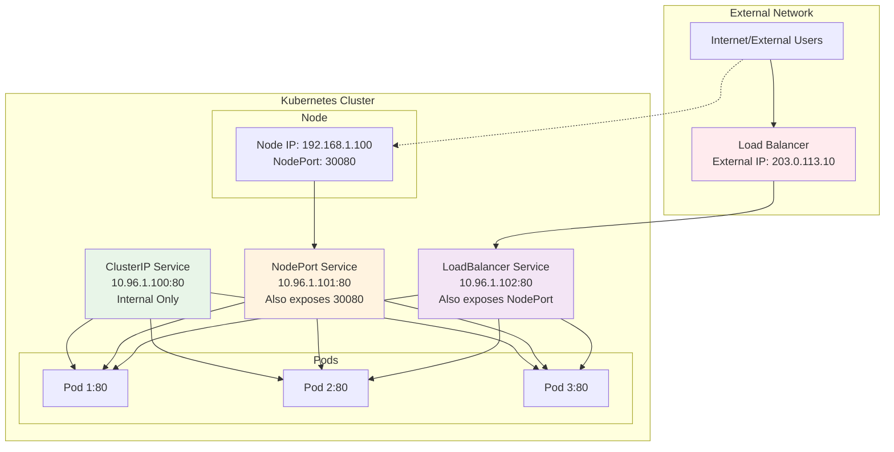
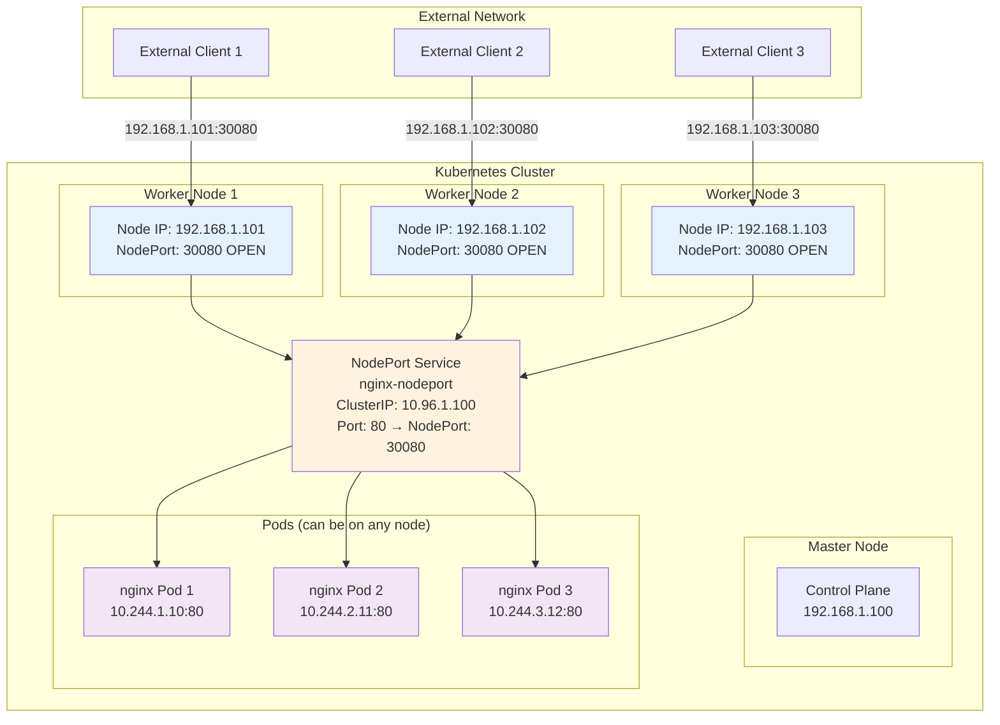
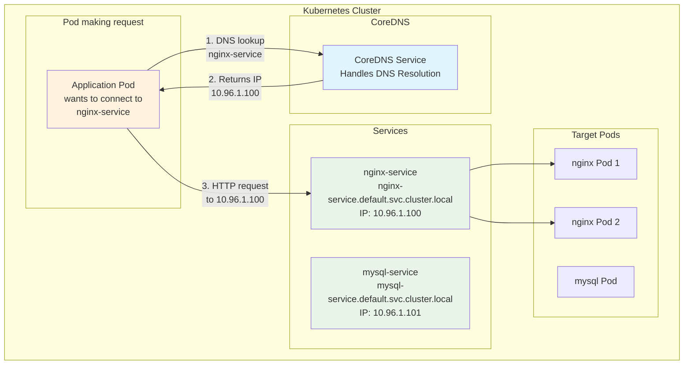
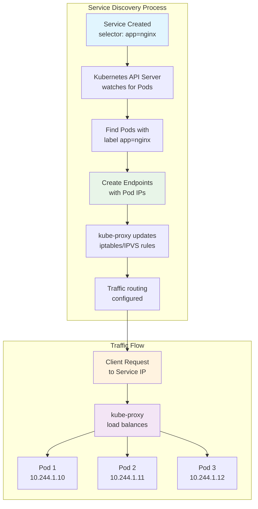

# Chapter 4: Services and Networking

## Learning Objectives

By the end of this chapter, you will understand:
- What Services are and why they're essential
- Different types of Services (ClusterIP, NodePort, LoadBalancer)
- How Kubernetes networking works
- Service discovery and DNS
- How to expose Pods for internal and external access

## The Problem: Pod Networking Challenges

In the previous chapter, we learned about Pods. However, Pods have some networking limitations:

1. **Dynamic IP addresses**: Pods get new IP addresses when they restart
2. **No load balancing**: Traffic can't be distributed across multiple Pod replicas
3. **No service discovery**: Other Pods can't easily find and connect to your Pod
4. **Ephemeral nature**: When a Pod dies, its network identity dies with it

## What is a Service?

A **Service** is a Kubernetes object that provides a stable network interface to a set of Pods. Think of it as a "front door" that remains constant even as the Pods behind it change.



### Key Service Characteristics

1. **Stable IP address**: Services get a consistent IP that doesn't change
2. **DNS name**: Services are automatically registered in cluster DNS
3. **Load balancing**: Traffic is distributed across healthy Pods
4. **Service discovery**: Other applications can find services by name

### Service Analogy

If Pods are like individual workers in a company:
- A **Service** is like the company's main phone number
- Calls to the main number get routed to available workers
- Even if workers change, the main number stays the same
- The phone system handles load distribution

## Your First Service

Let's start by creating a simple deployment and then expose it with a Service.

### Step 1: Create a Deployment

Create `nginx-deployment.yaml`:

```yaml
apiVersion: apps/v1
kind: Deployment
metadata:
  name: nginx-deployment
  labels:
    app: nginx
spec:
  replicas: 3
  selector:
    matchLabels:
      app: nginx
  template:
    metadata:
      labels:
        app: nginx
    spec:
      containers:
      - name: nginx
        image: nginx:1.21
        ports:
        - containerPort: 80
```

```bash
# Create the deployment
kubectl apply -f nginx-deployment.yaml

# Verify pods are running
kubectl get pods -l app=nginx
kubectl get deployment nginx-deployment
```

### Step 2: Create a ClusterIP Service

Create `nginx-service.yaml`:

```yaml
apiVersion: v1
kind: Service
metadata:
  name: nginx-service
spec:
  selector:
    app: nginx
  ports:
  - protocol: TCP
    port: 80
    targetPort: 80
  type: ClusterIP
```

```bash
# Create the service
kubectl apply -f nginx-service.yaml

# Check the service
kubectl get services
kubectl describe service nginx-service
```

### Understanding the Service YAML

```yaml
apiVersion: v1
kind: Service
metadata:
  name: nginx-service    # Service name (used for DNS)
spec:
  selector:              # Which Pods this Service targets
    app: nginx           # Matches Pods with label app=nginx
  ports:
  - protocol: TCP        # Protocol (TCP/UDP)
    port: 80            # Port the Service listens on
    targetPort: 80      # Port on the Pod containers
  type: ClusterIP       # Service type
```

## Service Types

Kubernetes provides four types of Services, each for different use cases:



### 1. ClusterIP (Default)

**Purpose**: Internal cluster communication only
**Access**: Only accessible from within the cluster

```yaml
apiVersion: v1
kind: Service
metadata:
  name: internal-service
spec:
  type: ClusterIP
  selector:
    app: my-app
  ports:
  - port: 80
    targetPort: 8080
```

**Use cases**:
- Database services
- Internal APIs
- Backend services

### 2. NodePort

**Purpose**: Expose service on each Node's IP at a static port
**Access**: Accessible from outside the cluster via `<NodeIP>:<NodePort>`



**Key NodePort Characteristics**:
- **Same port on all nodes**: Port 30080 is opened on ALL worker nodes
- **Any node access**: Traffic to any node IP:30080 reaches the same service
- **Load balancing**: kube-proxy distributes traffic across all pods
- **Port range**: 30000-32767 (can be configured)

```yaml
apiVersion: v1
kind: Service
metadata:
  name: nodeport-service
spec:
  type: NodePort
  selector:
    app: nginx
  ports:
  - port: 80
    targetPort: 80
    nodePort: 30080  # Optional: Kubernetes assigns if not specified
```

```bash
# Create NodePort service
kubectl apply -f nodeport-service.yaml

# Get the service URL with minikube
minikube service nodeport-service --url

# Or check the assigned NodePort
kubectl get service nodeport-service
```

**Use cases**:
- Development and testing
- Simple external access
- When you don't have a LoadBalancer

### 3. LoadBalancer

**Purpose**: Expose service externally using a cloud provider's load balancer
**Access**: External IP provided by cloud provider

```yaml
apiVersion: v1
kind: Service
metadata:
  name: loadbalancer-service
spec:
  type: LoadBalancer
  selector:
    app: nginx
  ports:
  - port: 80
    targetPort: 80
```

**Note**: In minikube, use `minikube tunnel` in another terminal to simulate LoadBalancer behavior.

**Use cases**:
- Production external access
- When you need a dedicated external IP
- Cloud environments (AWS, GCP, Azure)

### 4. ExternalName

**Purpose**: Map service to an external DNS name
**Access**: Returns CNAME record for external service

```yaml
apiVersion: v1
kind: Service
metadata:
  name: external-service
spec:
  type: ExternalName
  externalName: api.example.com
```

**Use cases**:
- Accessing external databases
- Third-party API integration
- Migration scenarios

## Hands-On: Working with Different Service Types

### Exercise 1: ClusterIP Service

```bash
# Create deployment (if not already created)
kubectl apply -f nginx-deployment.yaml

# Create ClusterIP service
kubectl apply -f nginx-service.yaml

# Test from inside the cluster
kubectl run test-pod --image=busybox -it --rm -- /bin/sh

# Inside the test pod:
wget -qO- http://nginx-service
nslookup nginx-service
exit
```

### Exercise 2: NodePort Service

Create `nginx-nodeport.yaml`:

```yaml
apiVersion: v1
kind: Service
metadata:
  name: nginx-nodeport
spec:
  type: NodePort
  selector:
    app: nginx
  ports:
  - port: 80
    targetPort: 80
    nodePort: 30080
```

```bash
# Create NodePort service
kubectl apply -f nginx-nodeport.yaml

# Get service details
kubectl get service nginx-nodeport

# Access via minikube
minikube service nginx-nodeport

# Or get the URL
minikube service nginx-nodeport --url
```

### Exercise 3: LoadBalancer with minikube

Create `nginx-loadbalancer.yaml`:

```yaml
apiVersion: v1
kind: Service
metadata:
  name: nginx-loadbalancer
spec:
  type: LoadBalancer
  selector:
    app: nginx
  ports:
  - port: 80
    targetPort: 80
```

```bash
# Create LoadBalancer service
kubectl apply -f nginx-loadbalancer.yaml

# In a separate terminal, enable LoadBalancer support
minikube tunnel

# Check service (should show EXTERNAL-IP)
kubectl get service nginx-loadbalancer

# Access via external IP
curl http://<EXTERNAL-IP>
```

## Service Discovery and DNS

Kubernetes automatically creates DNS records for Services, enabling easy service discovery.

### DNS Names for Services

Services get DNS names in the format:
```
<service-name>.<namespace>.svc.cluster.local
```

For the default namespace:
- Full name: `nginx-service.default.svc.cluster.local`
- Short name: `nginx-service` (from same namespace)



### Testing Service Discovery

```bash
# Create a test pod for DNS testing
kubectl run dns-test --image=busybox -it --rm -- /bin/sh

# Inside the pod, test different DNS formats:
nslookup nginx-service
nslookup nginx-service.default
nslookup nginx-service.default.svc.cluster.local

# Test connectivity
wget -qO- http://nginx-service
wget -qO- http://nginx-service.default.svc.cluster.local

exit
```

## Endpoints and Service Mechanics

### Understanding Endpoints

Services don't directly connect to Pods. Instead, they use **Endpoints**:

```bash
# Check service endpoints
kubectl get endpoints nginx-service
kubectl describe endpoints nginx-service

# This shows the actual Pod IPs that the service routes to
```

### How Service Routing Works

1. **Label Selection**: Service finds Pods matching its selector
2. **Endpoint Creation**: Kubernetes creates Endpoint objects with Pod IPs
3. **Traffic Routing**: kube-proxy routes traffic to healthy endpoints
4. **Load Balancing**: Traffic is distributed across available endpoints



### Viewing Service Details

```bash
# Detailed service information
kubectl describe service nginx-service

# Check which pods are selected
kubectl get pods -l app=nginx --show-labels

# See endpoint details
kubectl get endpoints nginx-service -o yaml
```

## Advanced Service Features

### Multiple Ports

Services can expose multiple ports:

```yaml
apiVersion: v1
kind: Service
metadata:
  name: multi-port-service
spec:
  selector:
    app: my-app
  ports:
  - name: http
    port: 80
    targetPort: 8080
  - name: https
    port: 443
    targetPort: 8443
  - name: metrics
    port: 9090
    targetPort: 9090
```

### Named Ports

You can use named ports in Pod specs and reference them in Services:

```yaml
# In Pod/Deployment spec:
ports:
- name: http
  containerPort: 8080
- name: metrics
  containerPort: 9090

# In Service spec:
ports:
- port: 80
  targetPort: http
- port: 9090
  targetPort: metrics
```

### Session Affinity

Direct traffic from the same client to the same Pod:

```yaml
apiVersion: v1
kind: Service
metadata:
  name: sticky-service
spec:
  selector:
    app: my-app
  ports:
  - port: 80
    targetPort: 8080
  sessionAffinity: ClientIP
  sessionAffinityConfig:
    clientIP:
      timeoutSeconds: 300
```

## Service Without Selectors

For external services or manual endpoint management:

```yaml
apiVersion: v1
kind: Service
metadata:
  name: external-database
spec:
  ports:
  - port: 3306
    targetPort: 3306

---
apiVersion: v1
kind: Endpoints
metadata:
  name: external-database
subsets:
- addresses:
  - ip: 192.168.1.100
  ports:
  - port: 3306
```

## Troubleshooting Service Issues

### Service Not Accessible

```bash
# Check service exists
kubectl get services

# Verify selector matches pod labels
kubectl describe service <service-name>
kubectl get pods --show-labels

# Check endpoints
kubectl get endpoints <service-name>

# Test DNS resolution
kubectl run test --image=busybox -it --rm -- nslookup <service-name>
```

### No Endpoints Available

```bash
# Check if pods are running
kubectl get pods -l <selector-label>

# Verify pod labels match service selector
kubectl describe service <service-name>

# Check pod readiness
kubectl describe pod <pod-name>
```

### Service Discovery Not Working

```bash
# Check CoreDNS pods
kubectl get pods -n kube-system -l k8s-app=kube-dns

# Test DNS from within cluster
kubectl run dns-debug --image=busybox -it --rm -- /bin/sh
# Inside: nslookup kubernetes.default
```

## Practical Examples

### Example 1: Multi-Tier Application

Create a complete web application with frontend and backend services:

```yaml
# Backend deployment and service
apiVersion: apps/v1
kind: Deployment
metadata:
  name: backend
spec:
  replicas: 2
  selector:
    matchLabels:
      app: backend
  template:
    metadata:
      labels:
        app: backend
    spec:
      containers:
      - name: backend
        image: nginx:1.21
        ports:
        - containerPort: 80

---
apiVersion: v1
kind: Service
metadata:
  name: backend-service
spec:
  selector:
    app: backend
  ports:
  - port: 80
    targetPort: 80
  type: ClusterIP

---
# Frontend deployment and service
apiVersion: apps/v1
kind: Deployment
metadata:
  name: frontend
spec:
  replicas: 3
  selector:
    matchLabels:
      app: frontend
  template:
    metadata:
      labels:
        app: frontend
    spec:
      containers:
      - name: frontend
        image: nginx:1.21
        ports:
        - containerPort: 80

---
apiVersion: v1
kind: Service
metadata:
  name: frontend-service
spec:
  selector:
    app: frontend
  ports:
  - port: 80
    targetPort: 80
    nodePort: 30080
  type: NodePort
```

### Example 2: Database Service

```yaml
apiVersion: apps/v1
kind: Deployment
metadata:
  name: mysql
spec:
  replicas: 1
  selector:
    matchLabels:
      app: mysql
  template:
    metadata:
      labels:
        app: mysql
    spec:
      containers:
      - name: mysql
        image: mysql:8.0
        env:
        - name: MYSQL_ROOT_PASSWORD
          value: "password123"
        ports:
        - containerPort: 3306

---
apiVersion: v1
kind: Service
metadata:
  name: mysql-service
spec:
  selector:
    app: mysql
  ports:
  - port: 3306
    targetPort: 3306
  type: ClusterIP
```

## Best Practices

### 1. Service Naming
- Use descriptive names: `user-api-service`, `payment-db-service`
- Follow consistent naming conventions
- Include environment in name if needed: `user-api-prod`

### 2. Port Configuration
- Use named ports for clarity
- Document port purposes
- Use standard ports when possible (80 for HTTP, 443 for HTTPS)

### 3. Service Types
- Use ClusterIP for internal services
- Use NodePort for development/testing
- Use LoadBalancer for production external access
- Avoid ExternalName unless absolutely necessary

### 4. Labels and Selectors
- Use consistent labeling strategy
- Include app, version, and component labels
- Ensure selectors match exactly

## Cleaning Up

```bash
# Delete services
kubectl delete service nginx-service
kubectl delete service nginx-nodeport
kubectl delete service nginx-loadbalancer

# Delete deployment
kubectl delete deployment nginx-deployment

# Delete all resources with label
kubectl delete all -l app=nginx
```

## Key Takeaways

1. **Services provide stable networking** - Pods come and go, Services remain constant
2. **Different types for different needs** - ClusterIP (internal), NodePort (development), LoadBalancer (production)
3. **Automatic service discovery** - DNS makes it easy to find services
4. **Label selectors connect Services to Pods** - Flexible and dynamic association
5. **Load balancing is built-in** - Traffic automatically distributed across healthy Pods

## Commands Reference

| Command | Purpose |
|---------|---------|
| `kubectl expose deployment <name> --port=<port>` | Create service for deployment |
| `kubectl get services` | List services |
| `kubectl describe service <name>` | Service details |
| `kubectl get endpoints` | List service endpoints |
| `minikube service <name>` | Access NodePort service |
| `minikube service <name> --url` | Get service URL |
| `kubectl port-forward service/<name> <local>:<remote>` | Forward to service |

---

**Next Chapter**: [Deployments and ReplicaSets](../05-deployments/) - Learn how to manage application lifecycle, scaling, and updates in Kubernetes.