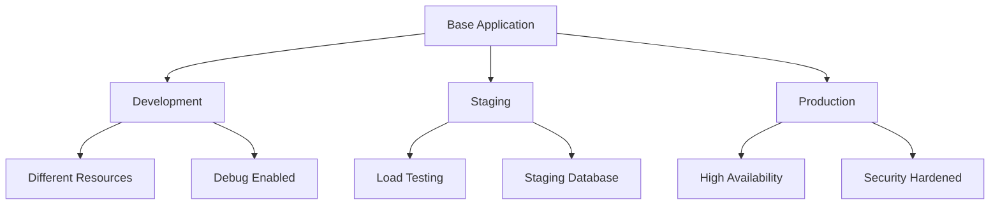
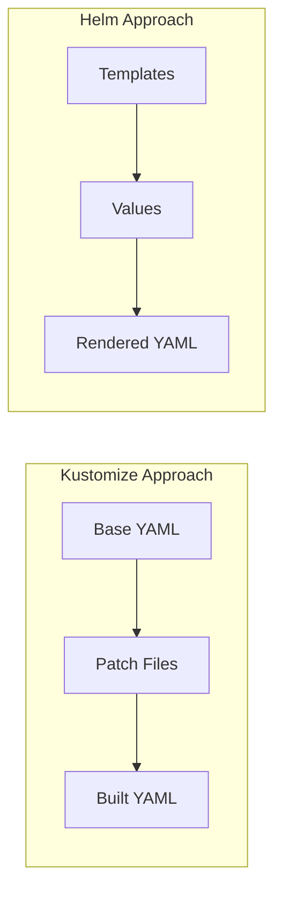
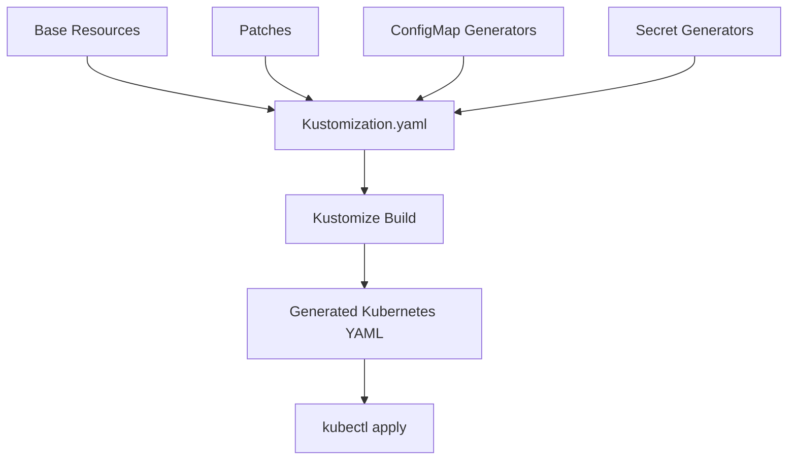

# Chapter 1: Introduction to Kustomize

## Learning Objectives

By the end of this chapter, you will be able to:
- Understand what Kustomize is and its core philosophy
- Identify when to use Kustomize over other configuration management tools
- Compare Kustomize with Helm and understand their different approaches
- Recognize common configuration management challenges that Kustomize solves
- Explore real-world use cases for Kustomize

## What is Kustomize and Why Use It?

Kustomize is a Kubernetes-native configuration management tool that follows the principle of "configuration as code" without templates. Unlike traditional templating solutions, Kustomize operates on plain Kubernetes YAML files using a declarative approach to customize configurations for different environments.

### Core Philosophy

Kustomize is built on several key principles:

1. **No Templates**: Work directly with valid Kubernetes YAML files
2. **Declarative Customization**: Apply transformations through configuration rather than logic
3. **Composability**: Build complex configurations from reusable components
4. **Environment Promotion**: Easily adapt base configurations for different environments

### Key Benefits

- **Simplicity**: No complex templating syntax to learn
- **Validation**: Base configurations are always valid Kubernetes YAML
- **Git-friendly**: Clear diffs and easy code reviews
- **Native Integration**: Built into kubectl since version 1.14
- **Composable**: Combine multiple customizations easily

## Configuration Management Challenges

Before diving deeper into Kustomize, let's examine the common challenges it addresses:

### 1. Environment Variations



Different environments require:
- Different resource limits and requests
- Environment-specific configuration values
- Varying replica counts
- Different secrets and ConfigMaps

### 2. Configuration Drift

Without proper tooling, environments can drift apart, leading to:
- Inconsistent deployments
- Difficult troubleshooting
- Reduced confidence in promotions

### 3. Maintenance Overhead

Traditional approaches often require:
- Complex templating logic
- Multiple configuration files per environment
- Manual synchronization between environments

## Kustomize vs Helm Comparison

Understanding when to use Kustomize versus Helm is crucial for making the right architectural decisions.



### Kustomize Strengths

| Feature | Kustomize | Helm |
|---------|-----------|------|
| Learning Curve | Low | Medium-High |
| Template Complexity | None | Can be complex |
| YAML Validity | Always valid | Templates not valid YAML |
| Debugging | Easy | Can be challenging |
| Native Integration | Built into kubectl | Separate tool |
| Package Management | No | Yes |
| Community Charts | No | Extensive |

### When to Choose Kustomize

Choose Kustomize when:
- You need simple configuration customization
- Your team prefers declarative approaches
- You want to work with plain Kubernetes YAML
- You need fine-grained control over patching
- You're building internal applications

### When to Choose Helm

Choose Helm when:
- You need complex templating logic
- You want to leverage community charts
- You need package management features
- You're deploying third-party applications
- You need release management capabilities

## When to Use Kustomize

Kustomize excels in several scenarios:

### 1. Multi-Environment Deployments

```yaml
# Base structure
base/
  ├── deployment.yaml
  ├── service.yaml
  └── kustomization.yaml

overlays/
  ├── development/
  │   ├── kustomization.yaml
  │   └── resource-limits.yaml
  ├── staging/
  │   ├── kustomization.yaml
  │   └── replicas.yaml
  └── production/
      ├── kustomization.yaml
      ├── replicas.yaml
      └── security.yaml
```

### 2. Configuration Variants

- Different resource requirements per environment
- Environment-specific feature flags
- Varying external service endpoints
- Different security policies

### 3. Team Collaboration

- Clear separation between base configurations and environment-specific changes
- Easy code reviews with meaningful diffs
- Shared base configurations across teams
- Gradual rollout of changes

## Real-World Use Cases

### Use Case 1: Microservices Platform

A company with 50+ microservices uses Kustomize to:
- Maintain a common base configuration for all services
- Apply environment-specific customizations
- Manage different resource profiles (small, medium, large)
- Handle security policies per environment

### Use Case 2: CI/CD Pipeline Integration

A development team integrates Kustomize into their GitOps workflow:
- Base configurations in the main branch
- Environment overlays in separate directories
- Automated testing of kustomizations
- Progressive deployment across environments

### Use Case 3: Multi-Tenant SaaS Application

A SaaS provider uses Kustomize for:
- Tenant-specific customizations
- Feature flag management per tenant
- Resource isolation and limits
- Compliance and security variations

## Common Anti-Patterns to Avoid

### 1. Over-Patching
```yaml
# Bad: Too many small patches
patches:
  - patch-1.yaml
  - patch-2.yaml
  - patch-3.yaml
  - patch-4.yaml

# Good: Consolidated patches
patches:
  - environment-config.yaml
```

### 2. Complex Directory Structures
```
# Bad: Overly nested
overlays/
  ├── regions/
  │   ├── us-east/
  │   │   ├── environments/
  │   │   │   ├── dev/
  │   │   │   └── prod/

# Good: Flat and clear
overlays/
  ├── dev-us-east/
  └── prod-us-east/
```

### 3. Ignoring Base Validation
Always ensure your base configurations are valid Kubernetes YAML that can be applied directly.

## Architecture Overview



The Kustomize workflow consists of:
1. **Base Resources**: Standard Kubernetes YAML files
2. **Kustomization.yaml**: Configuration file defining transformations
3. **Patches**: Files containing customizations
4. **Generators**: Dynamic creation of ConfigMaps and Secrets
5. **Build Process**: Combining all elements into final YAML
6. **Application**: Deploying to Kubernetes cluster

## Getting Started Preview

In the next chapter, we'll set up your development environment and install the necessary tools. Here's a preview of what we'll accomplish:

```bash
# Install Kustomize
curl -s "https://raw.githubusercontent.com/kubernetes-sigs/kustomize/master/hack/install_kustomize.sh" | bash

# Verify installation
kustomize version

# Your first build
kustomize build overlays/development/
```

## Chapter Summary

In this introduction, we covered:
- Kustomize's philosophy of declarative customization without templates
- Key benefits including simplicity, validation, and composability
- Common configuration management challenges
- Comparison with Helm and when to choose each tool
- Real-world use cases and architectural overview

The declarative, template-free approach of Kustomize makes it an excellent choice for teams that want to maintain simple, auditable, and version-controlled Kubernetes configurations while supporting multiple environments and deployment scenarios.

## Key Takeaways

1. **Kustomize is template-free**: Work with valid Kubernetes YAML files
2. **Declarative customization**: Define what you want, not how to get there
3. **Choose the right tool**: Kustomize for customization, Helm for packaging
4. **Start simple**: Begin with basic overlays before advanced features
5. **Plan your structure**: Organize directories for scalability and maintainability

---

**Next**: [Chapter 2: Setup and Environment](02-setup.md)

**Quick Links**: [Table of Contents](../README.md) | [Setup Guide](02-setup.md) | [Examples](../examples/chapter-01/)