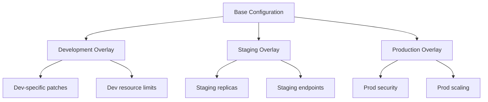
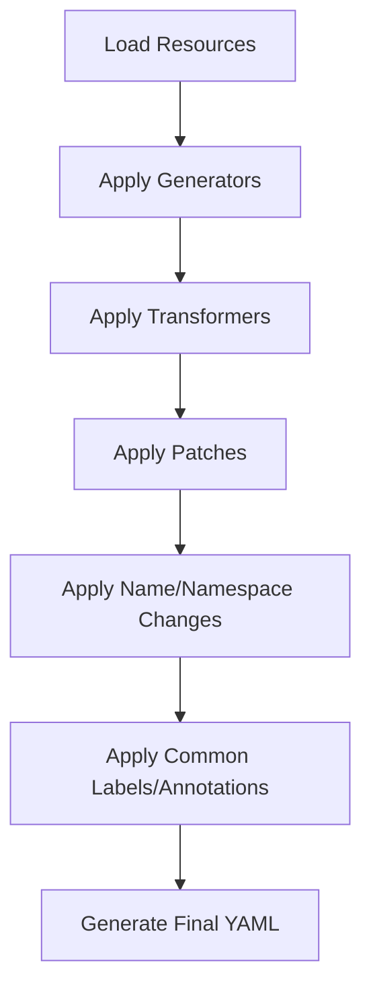
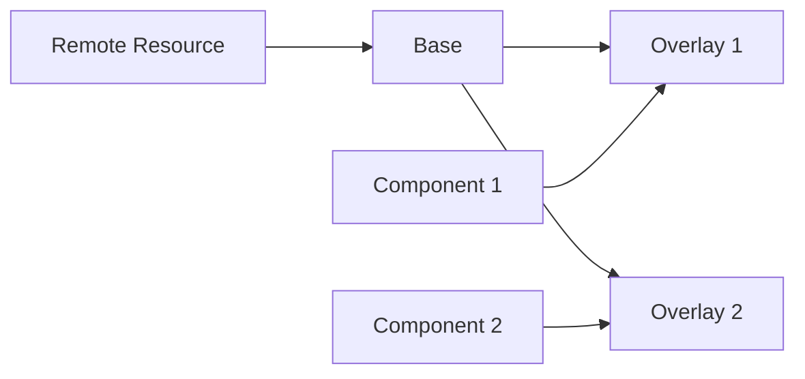
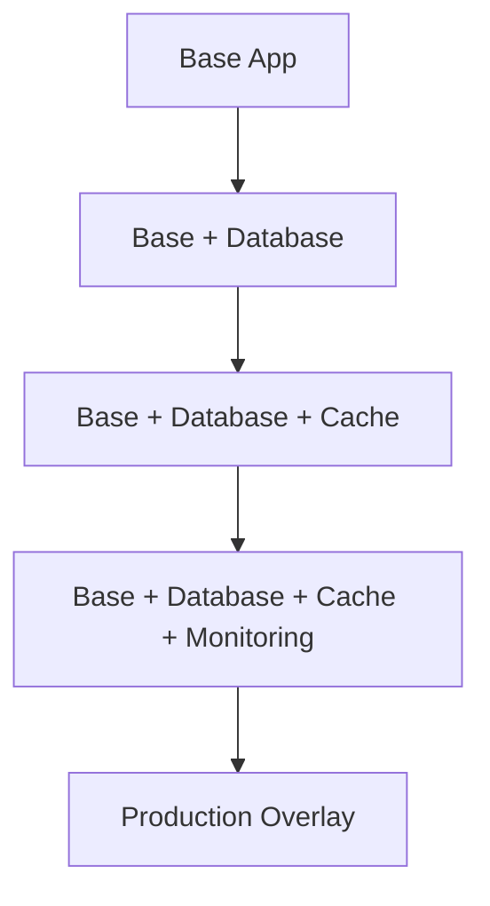
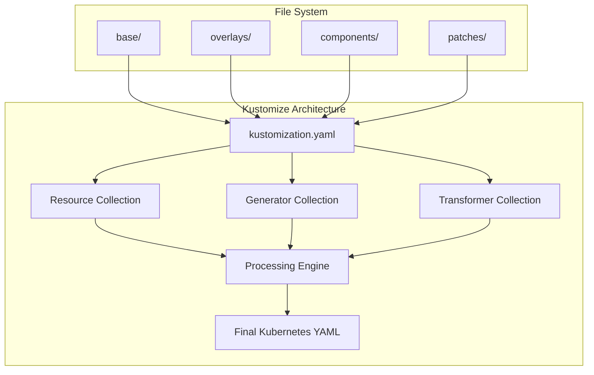

# Chapter 3: Basic Concepts and Architecture

## Learning Objectives

By the end of this chapter, you will be able to:
- Understand the base/overlay pattern and its benefits
- Navigate and create proper Kustomize directory structures
- Write and configure kustomization.yaml files
- Identify and use different types of resources, generators, and transformers
- Visualize Kustomize architecture and relationships

## Understanding the Base/Overlay Pattern

The base/overlay pattern is the fundamental architectural concept in Kustomize. It promotes reusability and maintainability by separating common configurations from environment-specific customizations.

### Core Concepts



#### Base
- Contains the common, environment-agnostic configuration
- Includes core Kubernetes resources (Deployments, Services, etc.)
- Should be valid and deployable on its own
- Serves as the foundation for all environments

#### Overlay
- Contains environment-specific customizations
- References the base configuration
- Applies patches, transformations, and additions
- Produces the final configuration for deployment

### Benefits of Base/Overlay Pattern

1. **DRY Principle**: Don't Repeat Yourself - common configuration written once
2. **Consistency**: All environments share the same base configuration
3. **Maintainability**: Changes to common elements propagate automatically
4. **Audibility**: Clear separation between common and environment-specific changes
5. **Scalability**: Easy to add new environments without duplication

## Directory Structure Conventions

A well-organized directory structure is crucial for maintainable Kustomize projects.

### Standard Layout

```
my-application/
├── base/
│   ├── kustomization.yaml
│   ├── deployment.yaml
│   ├── service.yaml
│   ├── configmap.yaml
│   └── ingress.yaml
├── overlays/
│   ├── development/
│   │   ├── kustomization.yaml
│   │   ├── replica-count.yaml
│   │   └── resource-limits.yaml
│   ├── staging/
│   │   ├── kustomization.yaml
│   │   ├── replica-count.yaml
│   │   └── ingress-patch.yaml
│   └── production/
│       ├── kustomization.yaml
│       ├── replica-count.yaml
│       ├── security-patch.yaml
│       └── resource-limits.yaml
└── components/
    ├── monitoring/
    │   ├── kustomization.yaml
    │   └── prometheus-config.yaml
    └── logging/
        ├── kustomization.yaml
        └── fluentd-config.yaml
```

### Directory Structure Best Practices

#### 1. Clear Naming
```
# Good
overlays/development/
overlays/staging/
overlays/production/

# Avoid
overlays/dev/
overlays/stg/
overlays/prod/
```

#### 2. Logical Grouping
```
# Group by environment
overlays/
├── development/
├── staging/
└── production/

# Or by region and environment
overlays/
├── us-east-dev/
├── us-east-prod/
├── eu-west-dev/
└── eu-west-prod/
```

#### 3. Component Organization
```
components/
├── database/
├── monitoring/
├── logging/
└── security/
```

## kustomization.yaml Structure

The `kustomization.yaml` file is the heart of every Kustomize configuration. It defines what resources to include and what transformations to apply.

### Basic Structure

```yaml
apiVersion: kustomize.config.k8s.io/v1beta1
kind: Kustomization

# Core sections
resources: []           # List of resource files or URLs
bases: []              # Deprecated: use resources instead
components: []         # List of components to include

# Generators
configMapGenerator: [] # Generate ConfigMaps
secretGenerator: []    # Generate Secrets

# Transformers
patches: []           # Strategic merge or JSON patches
patchesStrategicMerge: [] # Strategic merge patches (deprecated)
patchesJson6902: []   # JSON patches (deprecated)

# Name transformations
namePrefix: ""        # Prefix for all resource names
nameSuffix: ""        # Suffix for all resource names
namespace: ""         # Set namespace for all resources

# Label and annotation transformations
commonLabels: {}      # Labels added to all resources
commonAnnotations: {} # Annotations added to all resources

# Images
images: []           # Transform image names and tags

# Replacements
replacements: []     # Advanced field replacements

# Other options
replicas: []         # Replica count transformations
vars: []             # Variable definitions (deprecated)
```

### Complete Example

```yaml
apiVersion: kustomize.config.k8s.io/v1beta1
kind: Kustomization

metadata:
  name: my-app-production

# Resources to include
resources:
  - ../../base
  - certificate.yaml
  - network-policy.yaml

# Components to include
components:
  - ../../components/monitoring
  - ../../components/security

# Generated ConfigMaps
configMapGenerator:
  - name: app-config
    files:
      - config/app.properties
      - config/logging.conf
  - name: env-config
    literals:
      - ENVIRONMENT=production
      - LOG_LEVEL=warn

# Generated Secrets
secretGenerator:
  - name: app-secrets
    files:
      - secrets/database-password
      - secrets/api-key
    type: Opaque

# Patches
patches:
  - path: replica-count.yaml
    target:
      kind: Deployment
      name: my-app
  - path: resource-limits.yaml
    target:
      kind: Deployment
      name: my-app

# Name transformations
namePrefix: prod-
nameSuffix: -v1

# Namespace
namespace: production

# Common labels and annotations
commonLabels:
  environment: production
  managed-by: kustomize
  version: v1.0.0

commonAnnotations:
  deployment.kubernetes.io/revision: "1"
  app.kubernetes.io/managed-by: kustomize

# Image transformations
images:
  - name: my-app
    newTag: v1.2.3
  - name: nginx
    newName: my-registry/nginx
    newTag: 1.21-alpine

# Replica count
replicas:
  - name: my-app
    count: 5
```

## Resources, Generators, and Transformers

Understanding the different types of elements in Kustomize is essential for effective usage.

### Resources

Resources are the Kubernetes manifests that form the base of your application.

#### Types of Resources

1. **Local Files**
   ```yaml
   resources:
     - deployment.yaml
     - service.yaml
     - configmap.yaml
   ```

2. **Directories**
   ```yaml
   resources:
     - ../base
     - ./additional-resources/
   ```

3. **Remote URLs**
   ```yaml
   resources:
     - https://raw.githubusercontent.com/user/repo/main/k8s-manifest.yaml
   ```

4. **Git Repositories**
   ```yaml
   resources:
     - github.com/user/repo/k8s-configs?ref=v1.0.0
   ```

### Generators

Generators create Kubernetes resources dynamically from configuration files or literal values.

#### ConfigMap Generator

```yaml
configMapGenerator:
  # From files
  - name: app-config
    files:
      - config/app.properties
      - config/database.conf
    
  # From literals
  - name: env-vars
    literals:
      - ENVIRONMENT=production
      - DEBUG=false
      - MAX_CONNECTIONS=100
    
  # From environment file
  - name: env-file-config
    envs:
      - config/.env
    
  # With options
  - name: special-config
    files:
      - config/special.conf
    options:
      disableNameSuffixHash: true
      labels:
        config-type: special
      annotations:
        generated-by: kustomize
```

#### Secret Generator

```yaml
secretGenerator:
  # From files
  - name: app-secrets
    files:
      - secrets/database-password
      - secrets/api-key
    type: Opaque
    
  # From literals
  - name: credentials
    literals:
      - username=admin
      - password=secret123
    type: Opaque
    
  # TLS secrets
  - name: tls-secret
    files:
      - tls.crt=certs/server.crt
      - tls.key=certs/server.key
    type: kubernetes.io/tls
```

### Transformers

Transformers modify existing resources without changing the original files.

#### Patches

```yaml
patches:
  # Strategic merge patch
  - path: increase-replicas.yaml
    target:
      kind: Deployment
      name: my-app
      
  # Inline patch
  - patch: |
      - op: replace
        path: /spec/replicas
        value: 3
    target:
      kind: Deployment
      name: my-app
```

#### Image Transformations

```yaml
images:
  # Change tag
  - name: my-app
    newTag: v2.0.0
    
  # Change registry and tag
  - name: nginx
    newName: my-registry.com/nginx
    newTag: 1.21-alpine
    
  # Change digest
  - name: my-app
    digest: sha256:abc123...
```

#### Name Transformations

```yaml
namePrefix: dev-
nameSuffix: -test
```

This transforms:
- `my-app` → `dev-my-app-test`
- `my-service` → `dev-my-service-test`

## Architectural Relationships

Understanding how different elements interact is crucial for effective Kustomize usage.

### Processing Order



### Detailed Flow

1. **Resource Loading**
   - Load base resources
   - Load overlay resources
   - Merge resource lists

2. **Generation Phase**
   - Generate ConfigMaps
   - Generate Secrets
   - Add generated resources to collection

3. **Transformation Phase**
   - Apply image transformations
   - Apply replica transformations
   - Apply namespace changes

4. **Patching Phase**
   - Apply strategic merge patches
   - Apply JSON patches
   - Process replacements

5. **Naming Phase**
   - Apply name prefixes/suffixes
   - Generate name hashes for generated resources

6. **Labeling Phase**
   - Apply common labels
   - Apply common annotations

### Dependency Management



Kustomize handles dependencies automatically:
- Bases are processed before overlays
- Components are merged appropriately
- Remote resources are fetched as needed

## Common Patterns and Examples

### Pattern 1: Environment-Specific Configuration

**Base** (`base/kustomization.yaml`):
```yaml
apiVersion: kustomize.config.k8s.io/v1beta1
kind: Kustomization

resources:
  - deployment.yaml
  - service.yaml

commonLabels:
  app: my-app
```

**Development Overlay** (`overlays/development/kustomization.yaml`):
```yaml
apiVersion: kustomize.config.k8s.io/v1beta1
kind: Kustomization

resources:
  - ../../base

namePrefix: dev-
namespace: development

commonLabels:
  environment: development

replicas:
  - name: my-app
    count: 1

configMapGenerator:
  - name: env-config
    literals:
      - ENVIRONMENT=development
      - DEBUG=true
```

### Pattern 2: Multi-Component Application

```yaml
apiVersion: kustomize.config.k8s.io/v1beta1
kind: Kustomization

resources:
  - ../../base

components:
  - ../../components/database
  - ../../components/cache
  - ../../components/monitoring

patches:
  - path: production-patches.yaml
```

### Pattern 3: Progressive Configuration



## Validation and Best Practices

### kustomization.yaml Validation

Always validate your kustomization files:

```bash
# Validate syntax
kustomize build . --dry-run

# Validate against Kubernetes API
kustomize build . | kubectl apply --dry-run=client -f -

# Check for common issues
kustomize build . --enable-alpha-plugins --load_restrictor=none
```

### Common Mistakes to Avoid

1. **Invalid Base Resources**
   ```yaml
   # Bad: Base resources should be valid Kubernetes YAML
   resources:
     - incomplete-resource.yaml  # Missing required fields
   ```

2. **Circular Dependencies**
   ```yaml
   # Bad: Don't create circular references
   # overlay-a references overlay-b, overlay-b references overlay-a
   ```

3. **Overly Complex Patches**
   ```yaml
   # Bad: Too many patches make configuration hard to understand
   patches:
     - patch1.yaml
     - patch2.yaml
     - patch3.yaml
     - patch4.yaml
     - patch5.yaml
   ```

### Directory Organization Tips

1. **Keep bases simple and focused**
2. **Use descriptive overlay names**
3. **Group related patches together**
4. **Document complex transformations**
5. **Use components for reusable functionality**

## Visual Architecture Summary



## Chapter Summary

In this chapter, we explored:
- The base/overlay pattern as Kustomize's fundamental architecture
- Standard directory structure conventions and best practices
- Complete structure and options of kustomization.yaml files
- Different types of resources, generators, and transformers
- How Kustomize processes and combines different elements
- Common patterns and architectural relationships

Understanding these concepts provides the foundation for effectively using Kustomize in real-world scenarios. The base/overlay pattern promotes maintainable, scalable configuration management while the rich set of generators and transformers provides flexibility for complex deployment scenarios.

## Key Takeaways

1. **Base/overlay pattern**: Separates common configuration from environment-specific changes
2. **Directory structure matters**: Organize files logically for maintainability
3. **kustomization.yaml is central**: All transformations flow through this configuration file
4. **Processing order is important**: Understanding the flow helps debug issues
5. **Start simple**: Begin with basic patterns before adding complexity

---

**Next**: [Chapter 4: Your First Kustomization](04-first-kustomization.md)

**Previous**: [Chapter 2: Setup and Environment](02-setup.md)

**Quick Links**: [Table of Contents](../README.md) | [Examples](../examples/chapter-03/)