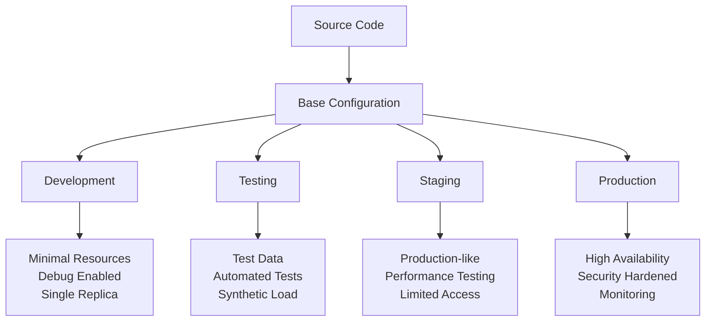
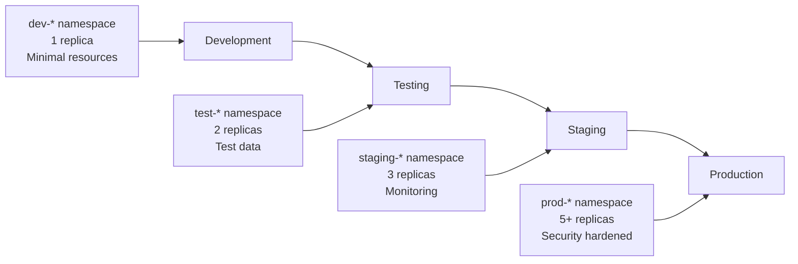

# Chapter 5: Overlays and Environments

## Learning Objectives

By the end of this chapter, you will be able to:
- Create sophisticated multi-environment configurations
- Implement environment-specific customizations effectively
- Use name prefixes and suffixes for resource organization
- Manage namespaces and resource isolation
- Scale applications differently across environments
- Apply environment promotion strategies

## Understanding Environment Challenges

Modern applications typically need to run in multiple environments, each with specific requirements:



### Common Environment Variations

| Aspect | Development | Testing | Staging | Production |
|--------|-------------|---------|---------|------------|
| **Replicas** | 1 | 2 | 3 | 5-10 |
| **Resources** | Minimal | Low | Medium | High |
| **Storage** | Local | Persistent | Persistent | Distributed |
| **Networking** | NodePort | ClusterIP | LoadBalancer | LoadBalancer |
| **Security** | Relaxed | Standard | Strict | Maximum |
| **Monitoring** | Basic | Standard | Full | Comprehensive |
| **Backup** | None | Daily | Hourly | Continuous |

## Advanced Multi-Environment Project

Let's build a comprehensive example with a web application that requires different configurations across environments.

### Project Structure

```
web-application/
├── base/
│   ├── kustomization.yaml
│   ├── deployment.yaml
│   ├── service.yaml
│   ├── configmap.yaml
│   └── hpa.yaml
├── overlays/
│   ├── development/
│   │   ├── kustomization.yaml
│   │   ├── dev-config.yaml
│   │   └── dev-resources.yaml
│   ├── testing/
│   │   ├── kustomization.yaml
│   │   ├── test-config.yaml
│   │   └── test-data.yaml
│   ├── staging/
│   │   ├── kustomization.yaml
│   │   ├── staging-config.yaml
│   │   ├── staging-ingress.yaml
│   │   └── monitoring.yaml
│   └── production/
│       ├── kustomization.yaml
│       ├── prod-config.yaml
│       ├── prod-security.yaml
│       ├── prod-monitoring.yaml
│       └── prod-scaling.yaml
└── components/
    ├── database/
    ├── monitoring/
    └── security/
```

## Creating the Base Configuration

### Base Deployment

Create `base/deployment.yaml`:

```yaml
apiVersion: apps/v1
kind: Deployment
metadata:
  name: web-app
  labels:
    app: web-app
spec:
  replicas: 2
  selector:
    matchLabels:
      app: web-app
  template:
    metadata:
      labels:
        app: web-app
    spec:
      containers:
      - name: web-app
        image: nginx:1.21
        ports:
        - containerPort: 8080
          name: http
        env:
        - name: PORT
          value: "8080"
        - name: NODE_ENV
          valueFrom:
            configMapKeyRef:
              name: app-config
              key: NODE_ENV
        resources:
          requests:
            memory: "128Mi"
            cpu: "100m"
          limits:
            memory: "256Mi"
            cpu: "200m"
        livenessProbe:
          httpGet:
            path: /health
            port: 8080
          initialDelaySeconds: 30
          periodSeconds: 10
          timeoutSeconds: 5
          failureThreshold: 3
        readinessProbe:
          httpGet:
            path: /ready
            port: 8080
          initialDelaySeconds: 5
          periodSeconds: 5
          timeoutSeconds: 3
          failureThreshold: 3
        volumeMounts:
        - name: config-volume
          mountPath: /app/config
          readOnly: true
      volumes:
      - name: config-volume
        configMap:
          name: app-config
      securityContext:
        runAsNonRoot: true
        runAsUser: 1000
        fsGroup: 2000
```

### Base Service

Create `base/service.yaml`:

```yaml
apiVersion: v1
kind: Service
metadata:
  name: web-app
  labels:
    app: web-app
spec:
  type: ClusterIP
  ports:
  - port: 80
    targetPort: 8080
    protocol: TCP
    name: http
  selector:
    app: web-app
```

### Base ConfigMap

Create `base/configmap.yaml`:

```yaml
apiVersion: v1
kind: ConfigMap
metadata:
  name: app-config
  labels:
    app: web-app
data:
  NODE_ENV: "production"
  LOG_LEVEL: "info"
  DATABASE_URL: "postgresql://localhost:5432/myapp"
  REDIS_URL: "redis://localhost:6379"
  app.properties: |
    server.port=8080
    server.servlet.context-path=/
    spring.datasource.url=${DATABASE_URL}
    spring.redis.url=${REDIS_URL}
    logging.level.root=${LOG_LEVEL}
    management.endpoints.web.exposure.include=health,info,metrics
```

### Base HPA

Create `base/hpa.yaml`:

```yaml
apiVersion: autoscaling/v2
kind: HorizontalPodAutoscaler
metadata:
  name: web-app-hpa
  labels:
    app: web-app
spec:
  scaleTargetRef:
    apiVersion: apps/v1
    kind: Deployment
    name: web-app
  minReplicas: 2
  maxReplicas: 10
  metrics:
  - type: Resource
    resource:
      name: cpu
      target:
        type: Utilization
        averageUtilization: 70
  - type: Resource
    resource:
      name: memory
      target:
        type: Utilization
        averageUtilization: 80
  behavior:
    scaleDown:
      stabilizationWindowSeconds: 300
      policies:
      - type: Percent
        value: 50
        periodSeconds: 60
    scaleUp:
      stabilizationWindowSeconds: 60
      policies:
      - type: Percent
        value: 100
        periodSeconds: 15
```

### Base Kustomization

Create `base/kustomization.yaml`:

```yaml
apiVersion: kustomize.config.k8s.io/v1beta1
kind: Kustomization

metadata:
  name: web-app-base

resources:
  - deployment.yaml
  - service.yaml
  - configmap.yaml
  - hpa.yaml

commonLabels:
  app: web-app
  managed-by: kustomize

commonAnnotations:
  app.kubernetes.io/version: "1.0.0"
  app.kubernetes.io/component: web-server

images:
  - name: nginx
    newTag: "1.21"
```

## Development Environment

### Development Configuration

Create `overlays/development/dev-config.yaml`:

```yaml
apiVersion: v1
kind: ConfigMap
metadata:
  name: app-config
data:
  NODE_ENV: "development"
  LOG_LEVEL: "debug"
  DEBUG_MODE: "true"
  DATABASE_URL: "postgresql://dev-db:5432/myapp_dev"
  REDIS_URL: "redis://dev-redis:6379"
  app.properties: |
    server.port=8080
    server.servlet.context-path=/
    spring.datasource.url=${DATABASE_URL}
    spring.redis.url=${REDIS_URL}
    logging.level.root=${LOG_LEVEL}
    logging.level.com.myapp=DEBUG
    spring.devtools.restart.enabled=true
    management.endpoints.web.exposure.include=*
```

### Development Resources

Create `overlays/development/dev-resources.yaml`:

```yaml
apiVersion: apps/v1
kind: Deployment
metadata:
  name: web-app
spec:
  replicas: 1
  template:
    spec:
      containers:
      - name: web-app
        resources:
          requests:
            memory: "64Mi"
            cpu: "50m"
          limits:
            memory: "128Mi"
            cpu: "100m"
        env:
        - name: JAVA_OPTS
          value: "-Xmx128m -Xms64m -XX:+UseG1GC"
        - name: DEBUG
          value: "true"

---
apiVersion: v1
kind: Service
metadata:
  name: web-app
spec:
  type: NodePort
  ports:
  - port: 80
    targetPort: 8080
    nodePort: 30080
    protocol: TCP
    name: http

---
apiVersion: autoscaling/v2
kind: HorizontalPodAutoscaler
metadata:
  name: web-app-hpa
spec:
  minReplicas: 1
  maxReplicas: 3
  metrics:
  - type: Resource
    resource:
      name: cpu
      target:
        type: Utilization
        averageUtilization: 80
```

### Development Kustomization

Create `overlays/development/kustomization.yaml`:

```yaml
apiVersion: kustomize.config.k8s.io/v1beta1
kind: Kustomization

metadata:
  name: web-app-development

resources:
  - ../../base

namePrefix: dev-
namespace: web-app-dev

commonLabels:
  environment: development
  tier: development

commonAnnotations:
  environment: development
  debug.enabled: "true"

patches:
  - path: dev-config.yaml
  - path: dev-resources.yaml

configMapGenerator:
  - name: dev-secrets
    literals:
      - API_KEY=dev-api-key-12345
      - SECRET_TOKEN=dev-secret-token
      - DATABASE_PASSWORD=dev-password

secretGenerator:
  - name: app-secrets
    literals:
      - database-password=devpassword123
      - jwt-secret=dev-jwt-secret-key
    type: Opaque

images:
  - name: nginx
    newTag: "1.21-alpine"

replicas:
  - name: web-app
    count: 1
```

## Testing Environment

### Testing Configuration

Create `overlays/testing/test-config.yaml`:

```yaml
apiVersion: v1
kind: ConfigMap
metadata:
  name: app-config
data:
  NODE_ENV: "test"
  LOG_LEVEL: "info"
  TEST_MODE: "true"
  DATABASE_URL: "postgresql://test-db:5432/myapp_test"
  REDIS_URL: "redis://test-redis:6379"
  app.properties: |
    server.port=8080
    spring.datasource.url=${DATABASE_URL}
    spring.redis.url=${REDIS_URL}
    logging.level.root=${LOG_LEVEL}
    spring.test.database.replace=none
    management.endpoints.web.exposure.include=health,info,metrics,prometheus
```

### Test Data Configuration

Create `overlays/testing/test-data.yaml`:

```yaml
apiVersion: batch/v1
kind: Job
metadata:
  name: test-data-loader
  labels:
    app: web-app
    component: test-data
spec:
  template:
    metadata:
      labels:
        app: web-app
        component: test-data
    spec:
      containers:
      - name: data-loader
        image: postgres:13
        command:
        - /bin/bash
        - -c
        - |
          echo "Loading test data..."
          psql $DATABASE_URL -c "
            INSERT INTO users (name, email) VALUES 
            ('Test User 1', 'test1@example.com'),
            ('Test User 2', 'test2@example.com'),
            ('Test User 3', 'test3@example.com');
          "
        env:
        - name: DATABASE_URL
          valueFrom:
            configMapKeyRef:
              name: app-config
              key: DATABASE_URL
      restartPolicy: Never
  backoffLimit: 3

---
apiVersion: apps/v1
kind: Deployment
metadata:
  name: web-app
spec:
  template:
    spec:
      containers:
      - name: web-app
        env:
        - name: ENABLE_TEST_ENDPOINTS
          value: "true"
        - name: TEST_DATA_ENABLED
          value: "true"
```

### Testing Kustomization

Create `overlays/testing/kustomization.yaml`:

```yaml
apiVersion: kustomize.config.k8s.io/v1beta1
kind: Kustomization

metadata:
  name: web-app-testing

resources:
  - ../../base

namePrefix: test-
namespace: web-app-test

commonLabels:
  environment: testing
  tier: testing

commonAnnotations:
  environment: testing
  test.enabled: "true"

patches:
  - path: test-config.yaml
  - path: test-data.yaml

configMapGenerator:
  - name: test-config
    literals:
      - TEST_SUITE=integration
      - MOCK_EXTERNAL_APIS=true
      - TEST_TIMEOUT=300

images:
  - name: nginx
    newTag: "1.21"

replicas:
  - name: web-app
    count: 2
```

## Staging Environment

### Staging Configuration

Create `overlays/staging/staging-config.yaml`:

```yaml
apiVersion: v1
kind: ConfigMap
metadata:
  name: app-config
data:
  NODE_ENV: "staging"
  LOG_LEVEL: "info"
  DATABASE_URL: "postgresql://staging-db.example.com:5432/myapp_staging"
  REDIS_URL: "redis://staging-redis.example.com:6379"
  app.properties: |
    server.port=8080
    spring.datasource.url=${DATABASE_URL}
    spring.redis.url=${REDIS_URL}
    logging.level.root=${LOG_LEVEL}
    management.endpoints.web.exposure.include=health,info,metrics,prometheus
    spring.security.require-ssl=true

---
apiVersion: apps/v1
kind: Deployment
metadata:
  name: web-app
spec:
  template:
    spec:
      containers:
      - name: web-app
        resources:
          requests:
            memory: "256Mi"
            cpu: "200m"
          limits:
            memory: "512Mi"
            cpu: "400m"
        env:
        - name: JAVA_OPTS
          value: "-Xmx512m -Xms256m -XX:+UseG1GC"
        - name: NEW_RELIC_ENABLED
          value: "true"
```

### Staging Ingress

Create `overlays/staging/staging-ingress.yaml`:

```yaml
apiVersion: networking.k8s.io/v1
kind: Ingress
metadata:
  name: web-app-ingress
  labels:
    app: web-app
  annotations:
    kubernetes.io/ingress.class: "nginx"
    cert-manager.io/cluster-issuer: "letsencrypt-staging"
    nginx.ingress.kubernetes.io/ssl-redirect: "true"
    nginx.ingress.kubernetes.io/force-ssl-redirect: "true"
spec:
  tls:
  - hosts:
    - staging.myapp.com
    secretName: staging-tls-secret
  rules:
  - host: staging.myapp.com
    http:
      paths:
      - path: /
        pathType: Prefix
        backend:
          service:
            name: web-app
            port:
              number: 80
```

### Staging Monitoring

Create `overlays/staging/monitoring.yaml`:

```yaml
apiVersion: v1
kind: ServiceMonitor
metadata:
  name: web-app-metrics
  labels:
    app: web-app
spec:
  selector:
    matchLabels:
      app: web-app
  endpoints:
  - port: http
    path: /actuator/prometheus
    interval: 30s

---
apiVersion: v1
kind: Service
metadata:
  name: web-app
  labels:
    app: web-app
  annotations:
    prometheus.io/scrape: "true"
    prometheus.io/port: "8080"
    prometheus.io/path: "/actuator/prometheus"
spec:
  ports:
  - port: 80
    targetPort: 8080
    protocol: TCP
    name: http
```

### Staging Kustomization

Create `overlays/staging/kustomization.yaml`:

```yaml
apiVersion: kustomize.config.k8s.io/v1beta1
kind: Kustomization

metadata:
  name: web-app-staging

resources:
  - ../../base

namePrefix: staging-
namespace: web-app-staging

commonLabels:
  environment: staging
  tier: staging

commonAnnotations:
  environment: staging
  monitoring.enabled: "true"

patches:
  - path: staging-config.yaml
  - path: staging-ingress.yaml
  - path: monitoring.yaml

secretGenerator:
  - name: app-secrets
    literals:
      - database-password=staging-secure-password
      - jwt-secret=staging-jwt-secret-key
      - new-relic-key=staging-nr-key
    type: Opaque

images:
  - name: nginx
    newTag: "1.21"

replicas:
  - name: web-app
    count: 3
```

## Production Environment

### Production Configuration

Create `overlays/production/prod-config.yaml`:

```yaml
apiVersion: v1
kind: ConfigMap
metadata:
  name: app-config
data:
  NODE_ENV: "production"
  LOG_LEVEL: "warn"
  DATABASE_URL: "postgresql://prod-db.internal:5432/myapp_prod"
  REDIS_URL: "redis://prod-redis.internal:6379"
  app.properties: |
    server.port=8080
    spring.datasource.url=${DATABASE_URL}
    spring.redis.url=${REDIS_URL}
    logging.level.root=${LOG_LEVEL}
    management.endpoints.web.exposure.include=health,info,metrics,prometheus
    spring.security.require-ssl=true
    server.ssl.enabled=true
    server.compression.enabled=true
    spring.cache.type=redis
    spring.session.store-type=redis

---
apiVersion: apps/v1
kind: Deployment
metadata:
  name: web-app
spec:
  strategy:
    type: RollingUpdate
    rollingUpdate:
      maxUnavailable: 1
      maxSurge: 1
  template:
    spec:
      containers:
      - name: web-app
        resources:
          requests:
            memory: "512Mi"
            cpu: "500m"
          limits:
            memory: "1Gi"
            cpu: "1000m"
        env:
        - name: JAVA_OPTS
          value: "-Xmx1g -Xms512m -XX:+UseG1GC -XX:+PrintGCDetails"
        - name: NEW_RELIC_ENABLED
          value: "true"
        - name: DATADOG_ENABLED
          value: "true"
      affinity:
        podAntiAffinity:
          preferredDuringSchedulingIgnoredDuringExecution:
          - weight: 100
            podAffinityTerm:
              labelSelector:
                matchExpressions:
                - key: app
                  operator: In
                  values:
                  - web-app
              topologyKey: kubernetes.io/hostname
```

### Production Security

Create `overlays/production/prod-security.yaml`:

```yaml
apiVersion: networking.k8s.io/v1
kind: NetworkPolicy
metadata:
  name: web-app-netpol
  labels:
    app: web-app
spec:
  podSelector:
    matchLabels:
      app: web-app
  policyTypes:
  - Ingress
  - Egress
  ingress:
  - from:
    - namespaceSelector:
        matchLabels:
          name: ingress-nginx
    - podSelector:
        matchLabels:
          app: nginx-ingress
    ports:
    - protocol: TCP
      port: 8080
  egress:
  - to:
    - namespaceSelector:
        matchLabels:
          name: database
    ports:
    - protocol: TCP
      port: 5432
  - to:
    - namespaceSelector:
        matchLabels:
          name: redis
    ports:
    - protocol: TCP
      port: 6379

---
apiVersion: v1
kind: ServiceAccount
metadata:
  name: web-app
  labels:
    app: web-app
  annotations:
    eks.amazonaws.com/role-arn: arn:aws:iam::123456789012:role/web-app-role

---
apiVersion: apps/v1
kind: Deployment
metadata:
  name: web-app
spec:
  template:
    spec:
      serviceAccountName: web-app
      securityContext:
        runAsNonRoot: true
        runAsUser: 1000
        fsGroup: 2000
        seccompProfile:
          type: RuntimeDefault
      containers:
      - name: web-app
        securityContext:
          allowPrivilegeEscalation: false
          readOnlyRootFilesystem: true
          capabilities:
            drop:
            - ALL
        volumeMounts:
        - name: tmp
          mountPath: /tmp
        - name: var-cache
          mountPath: /var/cache
      volumes:
      - name: tmp
        emptyDir: {}
      - name: var-cache
        emptyDir: {}
```

### Production Scaling

Create `overlays/production/prod-scaling.yaml`:

```yaml
apiVersion: autoscaling/v2
kind: HorizontalPodAutoscaler
metadata:
  name: web-app-hpa
spec:
  minReplicas: 5
  maxReplicas: 50
  metrics:
  - type: Resource
    resource:
      name: cpu
      target:
        type: Utilization
        averageUtilization: 60
  - type: Resource
    resource:
      name: memory
      target:
        type: Utilization
        averageUtilization: 70
  - type: Pods
    pods:
      metricName: http_requests_per_second
      targetAverageValue: "100"
  behavior:
    scaleDown:
      stabilizationWindowSeconds: 600
      policies:
      - type: Percent
        value: 25
        periodSeconds: 60
    scaleUp:
      stabilizationWindowSeconds: 60
      policies:
      - type: Percent
        value: 50
        periodSeconds: 30

---
apiVersion: policy/v1
kind: PodDisruptionBudget
metadata:
  name: web-app-pdb
  labels:
    app: web-app
spec:
  minAvailable: 3
  selector:
    matchLabels:
      app: web-app
```

### Production Kustomization

Create `overlays/production/kustomization.yaml`:

```yaml
apiVersion: kustomize.config.k8s.io/v1beta1
kind: Kustomization

metadata:
  name: web-app-production

resources:
  - ../../base

namePrefix: prod-
namespace: web-app-prod

commonLabels:
  environment: production
  tier: production

commonAnnotations:
  environment: production
  monitoring.enabled: "true"
  security.hardened: "true"

patches:
  - path: prod-config.yaml
  - path: prod-security.yaml
  - path: prod-scaling.yaml

secretGenerator:
  - name: app-secrets
    literals:
      - database-password=super-secure-prod-password
      - jwt-secret=production-jwt-secret-key
      - new-relic-key=production-nr-key
      - datadog-key=production-dd-key
    type: Opaque

images:
  - name: nginx
    newTag: "1.21"
    digest: sha256:a05b0cdd4fc1be3b224ba9662ebdf98fe44c09c0c9215b45f84344c12867002e

replicas:
  - name: web-app
    count: 5
```

## Environment Comparison and Promotion

### Comparing Environments

```bash
# Compare replica counts
echo "=== REPLICA COMPARISON ==="
for env in development testing staging production; do
  echo "$env:"
  kustomize build overlays/$env | grep -A 1 "kind: Deployment" | grep replicas:
done

# Compare resource limits
echo "=== RESOURCE COMPARISON ==="
for env in development testing staging production; do
  echo "$env:"
  kustomize build overlays/$env | grep -A 5 "resources:"
done

# Compare namespaces
echo "=== NAMESPACE COMPARISON ==="
for env in development testing staging production; do
  echo "$env:"
  kustomize build overlays/$env | grep "namespace:" | head -1
done
```

### Environment Promotion Strategy



### Promotion Process

1. **Development to Testing**
   ```bash
   # Validate development environment
   kustomize build overlays/development | kubectl apply --dry-run=client -f -
   
   # Test the promotion
   kustomize build overlays/testing | kubectl apply --dry-run=client -f -
   ```

2. **Testing to Staging**
   ```bash
   # Run integration tests
   kubectl apply -k overlays/testing
   ./run-integration-tests.sh
   
   # Promote to staging
   kubectl apply -k overlays/staging
   ```

3. **Staging to Production**
   ```bash
   # Performance and security validation
   kubectl apply -k overlays/staging
   ./run-performance-tests.sh
   ./run-security-scan.sh
   
   # Production deployment
   kubectl apply -k overlays/production
   ```

## Best Practices for Environment Management

### 1. Consistent Base Resources

```yaml
# Good: Base resources are environment-agnostic
apiVersion: apps/v1
kind: Deployment
metadata:
  name: app
spec:
  replicas: 2  # Default that can be overridden
  template:
    spec:
      containers:
      - name: app
        image: app:latest
        resources:
          requests:
            memory: "128Mi"  # Sensible defaults
```

### 2. Clear Environment Boundaries

```yaml
# Use distinct namespaces and prefixes
namePrefix: prod-
namespace: myapp-production

commonLabels:
  environment: production
  criticality: high
```

### 3. Security Progression

```yaml
# Development: Minimal security
securityContext:
  runAsNonRoot: true

# Production: Comprehensive security
securityContext:
  runAsNonRoot: true
  runAsUser: 1000
  fsGroup: 2000
  seccompProfile:
    type: RuntimeDefault
```

### 4. Resource Scaling Strategy

```yaml
# Development
replicas:
  - name: web-app
    count: 1
    
# Staging  
replicas:
  - name: web-app
    count: 3
    
# Production
replicas:
  - name: web-app
    count: 5
```

## Troubleshooting Multi-Environment Issues

### Common Problems

1. **Resource Conflicts**
   ```bash
   # Error: resources with same name in different namespaces
   # Solution: Use unique namePrefix or nameSuffix
   ```

2. **Configuration Drift**
   ```bash
   # Compare configurations
   diff <(kustomize build overlays/staging) <(kustomize build overlays/production)
   ```

3. **Missing Environment Variables**
   ```bash
   # Validate all required configs exist
   kustomize build overlays/production | grep -i "value.*required"
   ```

## Chapter Summary

In this chapter, we've explored:
- **Advanced multi-environment configurations** with development, testing, staging, and production
- **Environment-specific customizations** including resources, security, and monitoring
- **Name and namespace management** for resource isolation
- **Scaling strategies** appropriate for each environment
- **Environment promotion workflows** and validation techniques

### Key Patterns Learned

1. **Progressive Enhancement**: Each environment adds appropriate complexity
2. **Security Hardening**: Production environments require comprehensive security
3. **Resource Optimization**: Match resources to environment needs
4. **Isolation Strategy**: Use namespaces and prefixes for clear boundaries
5. **Validation Pipeline**: Test configurations before promotion

### Best Practices Applied

- Start with minimal development environments
- Add complexity progressively through environments
- Use consistent naming and labeling conventions
- Implement proper security boundaries
- Plan for environment-specific monitoring and scaling

This foundation enables you to manage complex applications across multiple environments while maintaining consistency and applying appropriate environment-specific optimizations.

---

**Next**: [Chapter 6: Strategic Merge Patches](06-patches-strategic-merge.md)

**Previous**: [Chapter 4: Your First Kustomization](04-first-kustomization.md)

**Quick Links**: [Table of Contents](../README.md) | [Examples](../examples/chapter-05/)