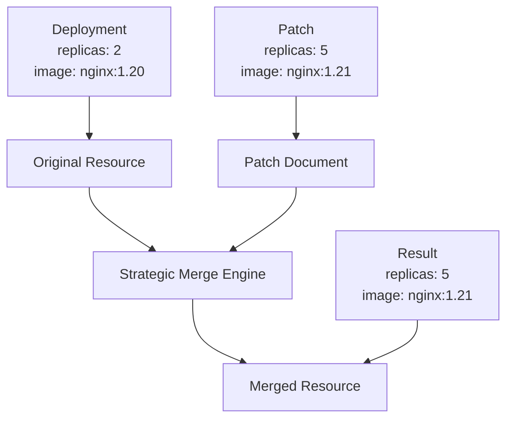

# Chapter 6: Strategic Merge Patches

## Learning Objectives

By the end of this chapter, you will be able to:
- Understand strategic merge patch mechanics and behavior
- Apply patches to deployments, services, and ConfigMaps effectively
- Add, modify, and remove fields using strategic merge patches
- Handle complex patching scenarios with nested objects and arrays
- Debug and troubleshoot patch application issues

## Understanding Strategic Merge Patches

Strategic merge patches are Kustomize's default patching mechanism, based on Kubernetes' strategic merge patch algorithm. Unlike simple JSON merge patches, strategic merge patches understand Kubernetes resource semantics and can intelligently merge arrays and objects.

### How Strategic Merge Works



### Key Principles

1. **Field-Level Merging**: Only specified fields are modified
2. **Array Strategies**: Different merge strategies for different array types
3. **Directive Preservation**: Maintains Kubernetes resource structure
4. **Type Awareness**: Understands Kubernetes resource schemas

## Basic Strategic Merge Patch Syntax

### Simple Field Replacement

```yaml
# Original deployment.yaml
apiVersion: apps/v1
kind: Deployment
metadata:
  name: web-app
spec:
  replicas: 2
  template:
    spec:
      containers:
      - name: app
        image: nginx:1.20
        resources:
          requests:
            memory: "128Mi"
            cpu: "100m"

# Patch file: replica-patch.yaml
apiVersion: apps/v1
kind: Deployment
metadata:
  name: web-app
spec:
  replicas: 5  # This will replace the original value
```

### Nested Object Patching

```yaml
# Patch file: resource-patch.yaml
apiVersion: apps/v1
kind: Deployment
metadata:
  name: web-app
spec:
  template:
    spec:
      containers:
      - name: app
        resources:
          requests:
            memory: "256Mi"  # Only memory is changed, cpu remains
          limits:            # Limits section is added
            memory: "512Mi"
            cpu: "500m"
```

## Comprehensive Patching Examples

Let's work with a complete application and explore various patching scenarios.

### Base Application

Create a base application with multiple components:

**base/deployment.yaml**:
```yaml
apiVersion: apps/v1
kind: Deployment
metadata:
  name: web-app
  labels:
    app: web-app
    version: v1.0.0
spec:
  replicas: 3
  selector:
    matchLabels:
      app: web-app
  template:
    metadata:
      labels:
        app: web-app
    spec:
      containers:
      - name: web-app
        image: nginx:1.20
        ports:
        - containerPort: 80
          name: http
        env:
        - name: NODE_ENV
          value: "production"
        - name: LOG_LEVEL
          value: "info"
        resources:
          requests:
            memory: "128Mi"
            cpu: "100m"
          limits:
            memory: "256Mi"
            cpu: "200m"
        volumeMounts:
        - name: config
          mountPath: /etc/config
        - name: data
          mountPath: /var/data
      - name: proxy
        image: envoy:v1.18
        ports:
        - containerPort: 8080
          name: proxy
        resources:
          requests:
            memory: "64Mi"
            cpu: "50m"
      volumes:
      - name: config
        configMap:
          name: app-config
      - name: data
        emptyDir: {}
      securityContext:
        runAsNonRoot: true
        runAsUser: 1000
```

**base/service.yaml**:
```yaml
apiVersion: v1
kind: Service
metadata:
  name: web-app
  labels:
    app: web-app
spec:
  type: ClusterIP
  ports:
  - port: 80
    targetPort: 80
    protocol: TCP
    name: http
  - port: 8080
    targetPort: 8080
    protocol: TCP
    name: proxy
  selector:
    app: web-app
```

**base/configmap.yaml**:
```yaml
apiVersion: v1
kind: ConfigMap
metadata:
  name: app-config
  labels:
    app: web-app
data:
  app.properties: |
    server.port=80
    server.host=0.0.0.0
    database.url=postgres://localhost:5432/myapp
    cache.enabled=true
    cache.ttl=3600
  nginx.conf: |
    server {
        listen 80;
        server_name localhost;
        location / {
            root /usr/share/nginx/html;
            index index.html;
        }
    }
```

## Patching Deployments

### 1. Scaling and Resource Patches

**patches/production-scaling.yaml**:
```yaml
apiVersion: apps/v1
kind: Deployment
metadata:
  name: web-app
spec:
  replicas: 10  # Scale up for production
  template:
    spec:
      containers:
      - name: web-app
        resources:
          requests:
            memory: "512Mi"
            cpu: "500m"
          limits:
            memory: "1Gi"
            cpu: "1000m"
      - name: proxy
        resources:
          requests:
            memory: "128Mi"
            cpu: "100m"
          limits:
            memory: "256Mi"
            cpu: "200m"
```

### 2. Environment Variable Patches

**patches/dev-environment.yaml**:
```yaml
apiVersion: apps/v1
kind: Deployment
metadata:
  name: web-app
spec:
  template:
    spec:
      containers:
      - name: web-app
        env:
        - name: NODE_ENV
          value: "development"  # Override existing variable
        - name: LOG_LEVEL
          value: "debug"       # Override existing variable
        - name: DEBUG_MODE     # Add new variable
          value: "true"
        - name: HOT_RELOAD     # Add new variable
          value: "enabled"
```

### 3. Image and Container Patches

**patches/image-updates.yaml**:
```yaml
apiVersion: apps/v1
kind: Deployment
metadata:
  name: web-app
spec:
  template:
    spec:
      containers:
      - name: web-app
        image: nginx:1.21-alpine  # Update main container image
      - name: proxy
        image: envoy:v1.19       # Update proxy image
```

### 4. Volume and Mount Patches

**patches/additional-volumes.yaml**:
```yaml
apiVersion: apps/v1
kind: Deployment
metadata:
  name: web-app
spec:
  template:
    spec:
      containers:
      - name: web-app
        volumeMounts:
        - name: config
          mountPath: /etc/config
        - name: data
          mountPath: /var/data
        - name: secrets          # Add new volume mount
          mountPath: /etc/secrets
          readOnly: true
        - name: logs            # Add new volume mount
          mountPath: /var/logs
      volumes:
      - name: config
        configMap:
          name: app-config
      - name: data
        emptyDir: {}
      - name: secrets           # Add new volume
        secret:
          secretName: app-secrets
      - name: logs             # Add new volume
        persistentVolumeClaim:
          claimName: logs-pvc
```

### 5. Security Context Patches

**patches/security-hardening.yaml**:
```yaml
apiVersion: apps/v1
kind: Deployment
metadata:
  name: web-app
spec:
  template:
    spec:
      securityContext:
        runAsNonRoot: true
        runAsUser: 1000
        fsGroup: 2000           # Add fsGroup
        seccompProfile:         # Add seccomp profile
          type: RuntimeDefault
      containers:
      - name: web-app
        securityContext:
          allowPrivilegeEscalation: false
          readOnlyRootFilesystem: true
          capabilities:
            drop:
            - ALL
      - name: proxy
        securityContext:        # Add security context to proxy
          allowPrivilegeEscalation: false
          readOnlyRootFilesystem: true
          capabilities:
            drop:
            - ALL
```

## Patching Services

### 1. Service Type Changes

**patches/nodeport-service.yaml**:
```yaml
apiVersion: v1
kind: Service
metadata:
  name: web-app
spec:
  type: NodePort              # Change from ClusterIP to NodePort
  ports:
  - port: 80
    targetPort: 80
    nodePort: 30080          # Add nodePort
    protocol: TCP
    name: http
  - port: 8080
    targetPort: 8080
    nodePort: 30081          # Add nodePort
    protocol: TCP
    name: proxy
```

### 2. LoadBalancer with Annotations

**patches/loadbalancer-service.yaml**:
```yaml
apiVersion: v1
kind: Service
metadata:
  name: web-app
  annotations:                # Add cloud-specific annotations
    service.beta.kubernetes.io/aws-load-balancer-type: nlb
    service.beta.kubernetes.io/aws-load-balancer-cross-zone-load-balancing-enabled: "true"
spec:
  type: LoadBalancer
  ports:
  - port: 80
    targetPort: 80
    protocol: TCP
    name: http
  - port: 8080
    targetPort: 8080
    protocol: TCP
    name: proxy
  loadBalancerSourceRanges:   # Add source IP restrictions
  - 10.0.0.0/8
  - 172.16.0.0/12
```

### 3. Service Port Modifications

**patches/additional-ports.yaml**:
```yaml
apiVersion: v1
kind: Service
metadata:
  name: web-app
spec:
  ports:
  - port: 80
    targetPort: 80
    protocol: TCP
    name: http
  - port: 8080
    targetPort: 8080
    protocol: TCP
    name: proxy
  - port: 9090               # Add metrics port
    targetPort: 9090
    protocol: TCP
    name: metrics
  - port: 8443               # Add secure port
    targetPort: 8443
    protocol: TCP
    name: https
```

## Patching ConfigMaps

### 1. Configuration Value Updates

**patches/database-config.yaml**:
```yaml
apiVersion: v1
kind: ConfigMap
metadata:
  name: app-config
data:
  app.properties: |
    server.port=80
    server.host=0.0.0.0
    database.url=postgres://prod-db:5432/myapp    # Updated URL
    database.pool.min=5                           # New setting
    database.pool.max=20                          # New setting
    cache.enabled=true
    cache.ttl=7200                                # Updated TTL
    cache.redis.url=redis://prod-redis:6379       # New cache setting
  nginx.conf: |
    server {
        listen 80;
        server_name localhost;
        
        # Add gzip compression
        gzip on;
        gzip_vary on;
        gzip_types text/plain text/css application/json application/javascript;
        
        location / {
            root /usr/share/nginx/html;
            index index.html;
            try_files $uri $uri/ =404;
        }
        
        # Add health check endpoint
        location /health {
            access_log off;
            return 200 "healthy\n";
            add_header Content-Type text/plain;
        }
    }
```

### 2. Adding New Configuration Files

**patches/monitoring-config.yaml**:
```yaml
apiVersion: v1
kind: ConfigMap
metadata:
  name: app-config
data:
  app.properties: |
    server.port=80
    server.host=0.0.0.0
    database.url=postgres://localhost:5432/myapp
    cache.enabled=true
    cache.ttl=3600
  nginx.conf: |
    server {
        listen 80;
        server_name localhost;
        location / {
            root /usr/share/nginx/html;
            index index.html;
        }
    }
  prometheus.yml: |           # Add new configuration file
    global:
      scrape_interval: 15s
    scrape_configs:
    - job_name: 'web-app'
      static_configs:
      - targets: ['localhost:9090']
  fluent.conf: |              # Add new configuration file
    <source>
      @type tail
      path /var/logs/*.log
      pos_file /var/log/fluentd-docker.log.pos
      tag docker.*
      format json
    </source>
```

## Complex Array Patching

### Understanding Array Merge Strategies

Different fields in Kubernetes resources use different array merge strategies:

1. **Replace Strategy**: Entire array is replaced
2. **Merge Strategy**: Arrays are merged based on key fields
3. **Strategic Merge Strategy**: Kubernetes-specific merge logic

### Container Array Patching

```yaml
# This patch merges containers by name
apiVersion: apps/v1
kind: Deployment
metadata:
  name: web-app
spec:
  template:
    spec:
      containers:
      - name: web-app          # Matches existing container by name
        image: nginx:1.21      # Updates only the image field
      - name: sidecar          # Adds new container
        image: busybox:1.34
        command: ["sleep", "3600"]
```

### Environment Variable Array Patching

```yaml
# Environment variables are merged by name
apiVersion: apps/v1
kind: Deployment
metadata:
  name: web-app
spec:
  template:
    spec:
      containers:
      - name: web-app
        env:
        - name: NODE_ENV       # Updates existing variable
          value: "staging"
        - name: NEW_FEATURE    # Adds new variable
          value: "enabled"
```

### Volume Mount Array Patching

```yaml
# Volume mounts are merged by name and mountPath
apiVersion: apps/v1
kind: Deployment
metadata:
  name: web-app
spec:
  template:
    spec:
      containers:
      - name: web-app
        volumeMounts:
        - name: config
          mountPath: /etc/config
          readOnly: true       # Adds readOnly to existing mount
        - name: cache          # Adds new volume mount
          mountPath: /var/cache
```

## Advanced Patching Scenarios

### 1. Conditional Patching

**patches/feature-flag-patch.yaml**:
```yaml
apiVersion: apps/v1
kind: Deployment
metadata:
  name: web-app
  labels:
    feature.new-ui: "enabled"  # Add feature flag label
spec:
  template:
    spec:
      containers:
      - name: web-app
        env:
        - name: FEATURE_NEW_UI
          value: "true"
        - name: FEATURE_BETA_API
          value: "false"
```

### 2. Multi-Container Patching

**patches/multi-container-patch.yaml**:
```yaml
apiVersion: apps/v1
kind: Deployment
metadata:
  name: web-app
spec:
  template:
    spec:
      containers:
      - name: web-app
        resources:
          requests:
            memory: "512Mi"
      - name: proxy
        resources:
          requests:
            memory: "256Mi"
      - name: monitoring        # Add new sidecar container
        image: prometheus/node-exporter:latest
        ports:
        - containerPort: 9100
          name: metrics
```

### 3. Init Container Patches

**patches/init-containers.yaml**:
```yaml
apiVersion: apps/v1
kind: Deployment
metadata:
  name: web-app
spec:
  template:
    spec:
      initContainers:          # Add init containers
      - name: db-migration
        image: migrate/migrate:latest
        command:
        - migrate
        - -path
        - /migrations
        - -database
        - $DATABASE_URL
        - up
        env:
        - name: DATABASE_URL
          valueFrom:
            secretKeyRef:
              name: db-secret
              key: url
      - name: cache-warmup
        image: redis:6-alpine
        command:
        - redis-cli
        - -h
        - redis-service
        - ping
```

## Debugging Strategic Merge Patches

### 1. Patch Validation

```bash
# Test patch application without applying
kustomize build overlays/production --dry-run

# Validate patch syntax
kustomize build overlays/production | kubectl apply --dry-run=client -f -

# Check specific resource after patching
kustomize build overlays/production | yq eval 'select(.kind == "Deployment")' -
```

### 2. Understanding Patch Results

```bash
# Compare original vs patched
echo "=== ORIGINAL ==="
kustomize build base | yq eval 'select(.kind == "Deployment") | .spec.replicas' -

echo "=== PATCHED ==="
kustomize build overlays/production | yq eval 'select(.kind == "Deployment") | .spec.replicas' -
```

### 3. Common Patch Issues

**Issue 1: Array Replacement Instead of Merge**
```yaml
# Problem: This replaces the entire containers array
containers:
- name: new-container
  image: new-image

# Solution: Include all containers you want to keep
containers:
- name: web-app        # Keep existing container
  image: nginx:1.21    # Only update specific fields
- name: proxy          # Keep existing container
- name: new-container  # Add new container
  image: new-image
```

**Issue 2: Incorrect Resource Targeting**
```yaml
# Problem: Patch doesn't match resource name/kind
apiVersion: apps/v1
kind: Deployment
metadata:
  name: wrong-name     # This won't match web-app

# Solution: Use correct resource identifiers
apiVersion: apps/v1
kind: Deployment
metadata:
  name: web-app        # Matches the target resource
```

## Patch Organization and Management

### 1. Single Patch per Concern

```
patches/
├── scaling.yaml          # Only replica and resource changes
├── environment.yaml      # Only environment variable changes
├── security.yaml         # Only security-related changes
└── monitoring.yaml       # Only monitoring configuration
```

### 2. Environment-Specific Patches

```
overlays/
├── development/
│   ├── dev-patches.yaml
│   └── kustomization.yaml
├── staging/
│   ├── staging-patches.yaml
│   └── kustomization.yaml
└── production/
    ├── prod-scaling.yaml
    ├── prod-security.yaml
    └── kustomization.yaml
```

### 3. Kustomization Configuration

```yaml
apiVersion: kustomize.config.k8s.io/v1beta1
kind: Kustomization

resources:
  - ../../base

patches:
  - path: scaling.yaml
  - path: environment.yaml
  - path: security.yaml
    target:
      kind: Deployment
      name: web-app          # Target specific resources
```

## Chapter Summary

In this chapter, we explored strategic merge patches in depth:

### Key Concepts Mastered
- **Strategic merge mechanics**: How Kustomize intelligently merges resources
- **Field-level patching**: Updating specific fields without affecting others
- **Array handling**: Different merge strategies for various array types
- **Complex scenarios**: Multi-container, init containers, and conditional patches

### Practical Skills Developed
- Creating effective patches for deployments, services, and ConfigMaps
- Managing environment variables and resource configurations
- Handling complex array merging scenarios
- Debugging and troubleshooting patch issues

### Best Practices Learned
- Organize patches by concern and environment
- Use precise resource targeting
- Validate patches before applying
- Understand array merge behavior for different Kubernetes fields

Strategic merge patches provide powerful, intuitive ways to customize Kubernetes resources while maintaining the base configuration's integrity. This foundation prepares you for more advanced patching techniques and complex deployment scenarios.

---

**Next**: [Chapter 7: JSON Patches (RFC 6902)](07-json-patches.md)

**Previous**: [Chapter 5: Overlays and Environments](05-overlays-environments.md)

**Quick Links**: [Table of Contents](../README.md) | [Examples](../examples/chapter-06/)