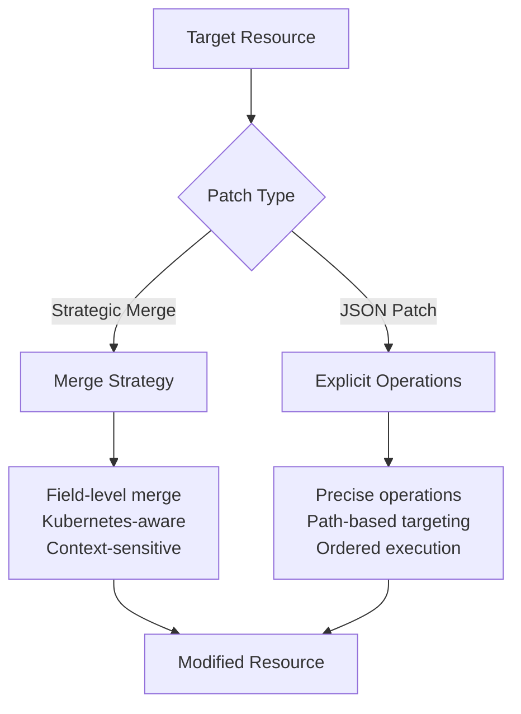

# Chapter 7: JSON Patches (RFC 6902)

## Learning Objectives

By the end of this chapter, you will be able to:
- Understand JSON Patch specification (RFC 6902) and its operations
- Choose between JSON patches and strategic merge patches appropriately
- Apply precise JSON patch operations for targeted modifications
- Handle complex array manipulations and nested object updates
- Troubleshoot and debug JSON patch issues effectively

## Understanding JSON Patches

JSON Patches provide a way to describe changes to JSON documents using a standardized format defined in RFC 6902. Unlike strategic merge patches, JSON patches are precise, explicit operations that describe exactly what changes to make.

### JSON Patch vs Strategic Merge



### When to Use JSON Patches

**Use JSON Patches when:**
- You need precise control over modifications
- Working with arrays at specific indices
- Removing specific fields or elements
- Order of operations matters
- Working with non-Kubernetes resources

**Use Strategic Merge when:**
- Modifying Kubernetes resources naturally
- Merging configuration changes
- Adding or updating container specifications
- Working with standard Kubernetes field semantics

## JSON Patch Operations

JSON Patch defines six operations, each with specific use cases:

### 1. `add` - Add values

```json
[
  {"op": "add", "path": "/spec/replicas", "value": 5}
]
```

### 2. `remove` - Remove values

```json
[
  {"op": "remove", "path": "/spec/template/spec/containers/0/env/2"}
]
```

### 3. `replace` - Replace values

```json
[
  {"op": "replace", "path": "/spec/template/spec/containers/0/image", "value": "nginx:1.21"}
]
```

### 4. `move` - Move values

```json
[
  {"op": "move", "from": "/spec/template/spec/containers/0", "path": "/spec/template/spec/containers/1"}
]
```

### 5. `copy` - Copy values

```json
[
  {"op": "copy", "from": "/spec/template/spec/containers/0/env/0", "path": "/spec/template/spec/containers/1/env/-"}
]
```

### 6. `test` - Test values

```json
[
  {"op": "test", "path": "/spec/replicas", "value": 3}
]
```

## Basic JSON Patch Examples

Let's start with a sample deployment for our examples:

### Base Deployment

**base/deployment.yaml**:
```yaml
apiVersion: apps/v1
kind: Deployment
metadata:
  name: web-app
  labels:
    app: web-app
    version: v1.0.0
spec:
  replicas: 3
  selector:
    matchLabels:
      app: web-app
  template:
    metadata:
      labels:
        app: web-app
    spec:
      containers:
      - name: web-app
        image: nginx:1.20
        ports:
        - containerPort: 80
          name: http
        env:
        - name: NODE_ENV
          value: "production"
        - name: LOG_LEVEL
          value: "info"
        resources:
          requests:
            memory: "128Mi"
            cpu: "100m"
          limits:
            memory: "256Mi"
            cpu: "200m"
      - name: sidecar
        image: busybox:1.34
        command: ["sleep", "3600"]
```

## Simple JSON Patch Operations

### 1. Scaling Applications

**patches/scale-replicas.yaml**:
```yaml
apiVersion: kustomize.config.k8s.io/v1beta1
kind: Kustomization

resources:
  - ../base

patches:
  - patch: |
      [
        {"op": "replace", "path": "/spec/replicas", "value": 10}
      ]
    target:
      kind: Deployment
      name: web-app
```

### 2. Updating Container Images

**patches/update-images.yaml**:
```yaml
patches:
  - patch: |
      [
        {"op": "replace", "path": "/spec/template/spec/containers/0/image", "value": "nginx:1.21"},
        {"op": "replace", "path": "/spec/template/spec/containers/1/image", "value": "busybox:1.35"}
      ]
    target:
      kind: Deployment
      name: web-app
```

### 3. Adding Environment Variables

**patches/add-env-vars.yaml**:
```yaml
patches:
  - patch: |
      [
        {"op": "add", "path": "/spec/template/spec/containers/0/env/-", "value": {"name": "DEBUG_MODE", "value": "true"}},
        {"op": "add", "path": "/spec/template/spec/containers/0/env/-", "value": {"name": "CACHE_ENABLED", "value": "false"}}
      ]
    target:
      kind: Deployment
      name: web-app
```

## Advanced Array Manipulations

### Understanding Array Indexing

JSON Patch uses zero-based indexing for arrays and supports special markers:
- `/0`, `/1`, `/2` - Specific indices
- `/-` - Append to end of array
- Array elements can be referenced by index

### 1. Inserting at Specific Positions

```yaml
patches:
  - patch: |
      [
        {"op": "add", "path": "/spec/template/spec/containers/0/env/1", "value": {"name": "INSERTED_VAR", "value": "inserted"}}
      ]
    target:
      kind: Deployment
      name: web-app
```

### 2. Removing Specific Array Elements

```yaml
patches:
  - patch: |
      [
        {"op": "remove", "path": "/spec/template/spec/containers/0/env/1"}
      ]
    target:
      kind: Deployment
      name: web-app
```

### 3. Moving Array Elements

```yaml
patches:
  - patch: |
      [
        {"op": "move", "from": "/spec/template/spec/containers/0/env/0", "path": "/spec/template/spec/containers/0/env/2"}
      ]
    target:
      kind: Deployment
      name: web-app
```

### 4. Complex Container Management

**patches/container-management.yaml**:
```yaml
patches:
  - patch: |
      [
        {
          "op": "add",
          "path": "/spec/template/spec/containers/-",
          "value": {
            "name": "monitoring",
            "image": "prometheus/node-exporter:latest",
            "ports": [{"containerPort": 9100, "name": "metrics"}],
            "resources": {
              "requests": {"memory": "64Mi", "cpu": "50m"},
              "limits": {"memory": "128Mi", "cpu": "100m"}
            }
          }
        },
        {
          "op": "add",
          "path": "/spec/template/spec/containers/0/volumeMounts",
          "value": [
            {"name": "config", "mountPath": "/etc/config", "readOnly": true}
          ]
        }
      ]
    target:
      kind: Deployment
      name: web-app
```

## Working with Nested Objects

### 1. Deep Object Modifications

**patches/deep-modifications.yaml**:
```yaml
patches:
  - patch: |
      [
        {
          "op": "add",
          "path": "/spec/template/spec/securityContext",
          "value": {
            "runAsNonRoot": true,
            "runAsUser": 1000,
            "fsGroup": 2000
          }
        },
        {
          "op": "add",
          "path": "/spec/template/spec/containers/0/securityContext",
          "value": {
            "allowPrivilegeEscalation": false,
            "readOnlyRootFilesystem": true,
            "capabilities": {"drop": ["ALL"]}
          }
        }
      ]
    target:
      kind: Deployment
      name: web-app
```

### 2. Resource Limit Modifications

**patches/resource-limits.yaml**:
```yaml
patches:
  - patch: |
      [
        {"op": "replace", "path": "/spec/template/spec/containers/0/resources/requests/memory", "value": "256Mi"},
        {"op": "replace", "path": "/spec/template/spec/containers/0/resources/requests/cpu", "value": "200m"},
        {"op": "replace", "path": "/spec/template/spec/containers/0/resources/limits/memory", "value": "512Mi"},
        {"op": "replace", "path": "/spec/template/spec/containers/0/resources/limits/cpu", "value": "500m"}
      ]
    target:
      kind: Deployment
      name: web-app
```

## Service Patching Examples

### Base Service

**base/service.yaml**:
```yaml
apiVersion: v1
kind: Service
metadata:
  name: web-app
  labels:
    app: web-app
spec:
  type: ClusterIP
  ports:
  - port: 80
    targetPort: 80
    protocol: TCP
    name: http
  selector:
    app: web-app
```

### 1. Adding Service Ports

**patches/service-ports.yaml**:
```yaml
patches:
  - patch: |
      [
        {
          "op": "add",
          "path": "/spec/ports/-",
          "value": {"port": 9100, "targetPort": 9100, "protocol": "TCP", "name": "metrics"}
        },
        {
          "op": "add",
          "path": "/spec/ports/-",
          "value": {"port": 8080, "targetPort": 8080, "protocol": "TCP", "name": "admin"}
        }
      ]
    target:
      kind: Service
      name: web-app
```

### 2. Changing Service Type

**patches/nodeport-service.yaml**:
```yaml
patches:
  - patch: |
      [
        {"op": "replace", "path": "/spec/type", "value": "NodePort"},
        {"op": "add", "path": "/spec/ports/0/nodePort", "value": 30080}
      ]
    target:
      kind: Service
      name: web-app
```

### 3. Adding Service Annotations

**patches/service-annotations.yaml**:
```yaml
patches:
  - patch: |
      [
        {
          "op": "add",
          "path": "/metadata/annotations",
          "value": {
            "service.beta.kubernetes.io/aws-load-balancer-type": "nlb",
            "service.beta.kubernetes.io/aws-load-balancer-cross-zone-load-balancing-enabled": "true"
          }
        }
      ]
    target:
      kind: Service
      name: web-app
```

## ConfigMap JSON Patching

### Base ConfigMap

**base/configmap.yaml**:
```yaml
apiVersion: v1
kind: ConfigMap
metadata:
  name: app-config
  labels:
    app: web-app
data:
  database.url: "postgres://localhost:5432/myapp"
  cache.enabled: "true"
  log.level: "info"
  app.properties: |
    server.port=8080
    server.host=0.0.0.0
    debug.enabled=false
```

### 1. Modifying Configuration Values

**patches/config-updates.yaml**:
```yaml
patches:
  - patch: |
      [
        {"op": "replace", "path": "/data/database.url", "value": "postgres://prod-db:5432/myapp"},
        {"op": "replace", "path": "/data/log.level", "value": "warn"},
        {"op": "add", "path": "/data/feature.newui", "value": "true"}
      ]
    target:
      kind: ConfigMap
      name: app-config
```

### 2. Updating Multi-line Configuration

**patches/properties-update.yaml**:
```yaml
patches:
  - patch: |
      [
        {
          "op": "replace",
          "path": "/data/app.properties",
          "value": "server.port=8080\nserver.host=0.0.0.0\ndebug.enabled=false\nmetrics.enabled=true\nhealth.check.interval=30\n"
        }
      ]
    target:
      kind: ConfigMap
      name: app-config
```

## Testing and Validation Operations

### 1. Conditional Patches with Test Operations

**patches/conditional-scaling.yaml**:
```yaml
patches:
  - patch: |
      [
        {"op": "test", "path": "/metadata/labels/environment", "value": "production"},
        {"op": "replace", "path": "/spec/replicas", "value": 10}
      ]
    target:
      kind: Deployment
      name: web-app
```

### 2. Safe Update Patterns

**patches/safe-updates.yaml**:
```yaml
patches:
  - patch: |
      [
        {"op": "test", "path": "/spec/template/spec/containers/0/image", "value": "nginx:1.20"},
        {"op": "replace", "path": "/spec/template/spec/containers/0/image", "value": "nginx:1.21"},
        {"op": "test", "path": "/spec/replicas", "value": 3},
        {"op": "replace", "path": "/spec/replicas", "value": 5}
      ]
    target:
      kind: Deployment
      name: web-app
```

## Complex Real-World Scenarios

### 1. Database Migration Patch

**patches/database-migration.yaml**:
```yaml
patches:
  - patch: |
      [
        {
          "op": "add",
          "path": "/spec/template/spec/initContainers",
          "value": [
            {
              "name": "db-migration",
              "image": "migrate/migrate:latest",
              "command": ["migrate", "-path", "/migrations", "-database", "$DATABASE_URL", "up"],
              "env": [
                {
                  "name": "DATABASE_URL",
                  "valueFrom": {
                    "secretKeyRef": {
                      "name": "db-secret",
                      "key": "url"
                    }
                  }
                }
              ],
              "volumeMounts": [
                {"name": "migrations", "mountPath": "/migrations", "readOnly": true}
              ]
            }
          ]
        },
        {
          "op": "add",
          "path": "/spec/template/spec/volumes",
          "value": [
            {
              "name": "migrations",
              "configMap": {
                "name": "db-migrations"
              }
            }
          ]
        }
      ]
    target:
      kind: Deployment
      name: web-app
```

### 2. Monitoring and Observability

**patches/observability.yaml**:
```yaml
patches:
  - patch: |
      [
        {
          "op": "add",
          "path": "/spec/template/metadata/annotations",
          "value": {
            "prometheus.io/scrape": "true",
            "prometheus.io/port": "9090",
            "prometheus.io/path": "/metrics"
          }
        },
        {
          "op": "add",
          "path": "/spec/template/spec/containers/0/ports/-",
          "value": {"containerPort": 9090, "name": "metrics", "protocol": "TCP"}
        },
        {
          "op": "add",
          "path": "/spec/template/spec/containers/-",
          "value": {
            "name": "log-collector",
            "image": "fluent/fluent-bit:1.8",
            "volumeMounts": [
              {"name": "varlog", "mountPath": "/var/log", "readOnly": true},
              {"name": "varlibdockercontainers", "mountPath": "/var/lib/docker/containers", "readOnly": true},
              {"name": "fluent-bit-config", "mountPath": "/fluent-bit/etc"}
            ]
          }
        },
        {
          "op": "add",
          "path": "/spec/template/spec/volumes/-",
          "value": {"name": "varlog", "hostPath": {"path": "/var/log"}}
        },
        {
          "op": "add",
          "path": "/spec/template/spec/volumes/-",
          "value": {"name": "varlibdockercontainers", "hostPath": {"path": "/var/lib/docker/containers"}}
        },
        {
          "op": "add",
          "path": "/spec/template/spec/volumes/-",
          "value": {"name": "fluent-bit-config", "configMap": {"name": "fluent-bit-config"}}
        }
      ]
    target:
      kind: Deployment
      name: web-app
```

### 3. Security Hardening

**patches/security-hardening.yaml**:
```yaml
patches:
  - patch: |
      [
        {
          "op": "add",
          "path": "/spec/template/spec/securityContext",
          "value": {
            "runAsNonRoot": true,
            "runAsUser": 1000,
            "fsGroup": 2000,
            "seccompProfile": {"type": "RuntimeDefault"}
          }
        },
        {
          "op": "add",
          "path": "/spec/template/spec/containers/0/securityContext",
          "value": {
            "allowPrivilegeEscalation": false,
            "readOnlyRootFilesystem": true,
            "capabilities": {"drop": ["ALL"]}
          }
        },
        {
          "op": "add",
          "path": "/spec/template/spec/containers/0/volumeMounts/-",
          "value": {"name": "tmp", "mountPath": "/tmp"}
        },
        {
          "op": "add",
          "path": "/spec/template/spec/containers/0/volumeMounts/-",
          "value": {"name": "var-cache", "mountPath": "/var/cache"}
        },
        {
          "op": "add",
          "path": "/spec/template/spec/volumes/-",
          "value": {"name": "tmp", "emptyDir": {}}
        },
        {
          "op": "add",
          "path": "/spec/template/spec/volumes/-",
          "value": {"name": "var-cache", "emptyDir": {}}
        }
      ]
    target:
      kind: Deployment
      name: web-app
```

## Environment-Specific JSON Patches

### Development Environment

**overlays/development/kustomization.yaml**:
```yaml
apiVersion: kustomize.config.k8s.io/v1beta1
kind: Kustomization

resources:
  - ../../base

namePrefix: dev-
namespace: development

patches:
  - patch: |
      [
        {"op": "replace", "path": "/spec/replicas", "value": 1},
        {"op": "replace", "path": "/spec/template/spec/containers/0/env/0/value", "value": "development"},
        {"op": "replace", "path": "/spec/template/spec/containers/0/env/1/value", "value": "debug"},
        {"op": "add", "path": "/spec/template/spec/containers/0/env/-", "value": {"name": "HOT_RELOAD", "value": "true"}}
      ]
    target:
      kind: Deployment
      name: web-app
  
  - patch: |
      [
        {"op": "replace", "path": "/spec/type", "value": "NodePort"},
        {"op": "add", "path": "/spec/ports/0/nodePort", "value": 30080}
      ]
    target:
      kind: Service
      name: web-app
```

### Production Environment

**overlays/production/kustomization.yaml**:
```yaml
apiVersion: kustomize.config.k8s.io/v1beta1
kind: Kustomization

resources:
  - ../../base

namePrefix: prod-
namespace: production

patches:
  - patch: |
      [
        {"op": "replace", "path": "/spec/replicas", "value": 10},
        {"op": "replace", "path": "/spec/template/spec/containers/0/resources/requests/memory", "value": "512Mi"},
        {"op": "replace", "path": "/spec/template/spec/containers/0/resources/requests/cpu", "value": "500m"},
        {"op": "replace", "path": "/spec/template/spec/containers/0/resources/limits/memory", "value": "1Gi"},
        {"op": "replace", "path": "/spec/template/spec/containers/0/resources/limits/cpu", "value": "1000m"},
        {
          "op": "add",
          "path": "/spec/template/spec/affinity",
          "value": {
            "podAntiAffinity": {
              "preferredDuringSchedulingIgnoredDuringExecution": [
                {
                  "weight": 100,
                  "podAffinityTerm": {
                    "labelSelector": {
                      "matchExpressions": [
                        {"key": "app", "operator": "In", "values": ["web-app"]}
                      ]
                    },
                    "topologyKey": "kubernetes.io/hostname"
                  }
                }
              ]
            }
          }
        }
      ]
    target:
      kind: Deployment
      name: web-app

  - patch: |
      [
        {"op": "replace", "path": "/spec/type", "value": "LoadBalancer"},
        {
          "op": "add",
          "path": "/metadata/annotations",
          "value": {
            "service.beta.kubernetes.io/aws-load-balancer-type": "nlb",
            "service.beta.kubernetes.io/aws-load-balancer-cross-zone-load-balancing-enabled": "true"
          }
        }
      ]
    target:
      kind: Service
      name: web-app
```

## Debugging JSON Patches

### 1. Validation Techniques

```bash
# Validate JSON patch syntax
echo '[{"op": "replace", "path": "/spec/replicas", "value": 5}]' | jq .

# Test patch application
kustomize build overlays/production --dry-run

# Compare before and after
echo "=== BEFORE ==="
kustomize build base | yq eval 'select(.kind == "Deployment") | .spec.replicas' -

echo "=== AFTER ==="
kustomize build overlays/production | yq eval 'select(.kind == "Deployment") | .spec.replicas' -
```

### 2. Common JSON Patch Errors

**Invalid Path Error**:
```bash
# Error: path "/spec/template/spec/containers/999" not found
# Solution: Verify array indices exist
kustomize build base | yq eval 'select(.kind == "Deployment") | .spec.template.spec.containers | length' -
```

**Invalid JSON Syntax**:
```yaml
# Wrong: Missing quotes
patches:
  - patch: |
      [
        {op: "replace", path: "/spec/replicas", value: 5}
      ]

# Correct: Proper JSON
patches:
  - patch: |
      [
        {"op": "replace", "path": "/spec/replicas", "value": 5}
      ]
```

**Path Not Found**:
```yaml
# Wrong: Non-existent path
{"op": "replace", "path": "/spec/nonexistent", "value": "test"}

# Correct: Verify paths exist
# Use: kustomize build base | yq eval 'paths' - | grep spec
```

### 3. Debugging Workflow

```bash
#!/bin/bash
# debug-json-patches.sh

echo "Debugging JSON patches..."

# 1. Validate base configuration
echo "=== BASE VALIDATION ==="
kustomize build base > base-output.yaml
kubectl apply --dry-run=client -f base-output.yaml

# 2. Check patch syntax
echo "=== PATCH SYNTAX CHECK ==="
yq eval '.patches[].patch' overlays/production/kustomization.yaml | while read -r patch; do
    echo "$patch" | jq . || echo "Invalid JSON in patch: $patch"
done

# 3. Apply patches step by step
echo "=== PATCH APPLICATION ==="
kustomize build overlays/production > patched-output.yaml
kubectl apply --dry-run=client -f patched-output.yaml

# 4. Show differences
echo "=== DIFFERENCES ==="
diff base-output.yaml patched-output.yaml

echo "Debug complete!"
```

## Performance and Best Practices

### 1. Efficient Patch Organization

```yaml
# Good: Group related operations
patches:
  - patch: |
      [
        {"op": "replace", "path": "/spec/replicas", "value": 10},
        {"op": "replace", "path": "/spec/template/spec/containers/0/resources/requests/memory", "value": "512Mi"},
        {"op": "replace", "path": "/spec/template/spec/containers/0/resources/requests/cpu", "value": "500m"}
      ]
    target:
      kind: Deployment
      name: web-app

# Avoid: Multiple separate patches for related changes
patches:
  - patch: '[{"op": "replace", "path": "/spec/replicas", "value": 10}]'
    target: {kind: Deployment, name: web-app}
  - patch: '[{"op": "replace", "path": "/spec/template/spec/containers/0/resources/requests/memory", "value": "512Mi"}]'
    target: {kind: Deployment, name: web-app}
```

### 2. Path Optimization

```yaml
# Use specific paths when possible
{"op": "replace", "path": "/spec/template/spec/containers/0/image", "value": "nginx:1.21"}

# Avoid wildcards or complex selectors in JSON patches
# JSON patches don't support complex selectors like strategic merge
```

### 3. Error Prevention

```yaml
# Use test operations for safety
[
  {"op": "test", "path": "/spec/replicas", "value": 3},
  {"op": "replace", "path": "/spec/replicas", "value": 10}
]

# Document complex paths
# Path: /spec/template/spec/containers/0/env/2
# Description: LOG_LEVEL environment variable
{"op": "replace", "path": "/spec/template/spec/containers/0/env/2/value", "value": "debug"}
```

## Chapter Summary

In this chapter, we explored JSON Patches in depth:

### Key Concepts Mastered
- **RFC 6902 Operations**: All six JSON patch operations with practical examples
- **Precise Targeting**: Exact path-based modifications for complex scenarios
- **Array Manipulation**: Advanced techniques for working with arrays and indices
- **Complex Scenarios**: Real-world applications including security, monitoring, and database integration

### Practical Skills Developed
- Creating precise JSON patches for specific modifications
- Handling complex array operations and nested object updates
- Debugging and validating JSON patch syntax and application
- Choosing between JSON patches and strategic merge patches appropriately

### Best Practices Learned
- Group related operations for efficiency
- Use test operations for safety
- Validate paths before applying patches
- Document complex patch operations
- Choose the right patching strategy for each scenario

JSON patches provide powerful, precise control over resource modifications, complementing strategic merge patches for comprehensive Kustomize customization capabilities.

---

**Next**: [Chapter 8: ConfigMaps and Secrets Generation](08-configmaps-secrets.md)

**Previous**: [Chapter 6: Strategic Merge Patches](06-patches-strategic-merge.md)

**Quick Links**: [Table of Contents](../README.md) | [Examples](../examples/chapter-07/)