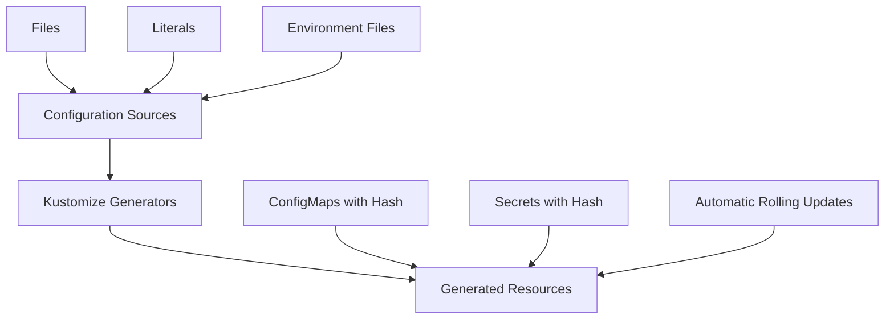

# Chapter 8: ConfigMaps and Secrets Generation

## Learning Objectives

By the end of this chapter, you will be able to:
- Generate ConfigMaps from files, literals, and environment files
- Create Secrets dynamically with proper security practices
- Use different generation options and customizations
- Implement environment-specific configuration strategies
- Handle configuration updates and rolling deployments
- Apply security best practices for secret management

## Understanding Configuration Management

Configuration management is crucial for maintaining applications across different environments. Kustomize provides powerful generators that create ConfigMaps and Secrets dynamically, enabling:

- **Dynamic Generation**: Create configurations from various sources
- **Hash Suffixes**: Automatic rolling updates when configuration changes
- **Environment Isolation**: Different configurations per environment
- **Security**: Proper handling of sensitive data



## ConfigMap Generation

ConfigMaps store non-sensitive configuration data. Kustomize can generate them from multiple sources.

### Basic ConfigMap Generation

**From Literal Values**:
```yaml
# kustomization.yaml
apiVersion: kustomize.config.k8s.io/v1beta1
kind: Kustomization

configMapGenerator:
  - name: app-config
    literals:
      - DATABASE_HOST=postgres.example.com
      - DATABASE_PORT=5432
      - LOG_LEVEL=info
      - FEATURE_FLAG_NEW_UI=true
      - MAX_CONNECTIONS=100
```

**Generated Result**:
```yaml
apiVersion: v1
kind: ConfigMap
metadata:
  name: app-config-6ft4t2mhc9
data:
  DATABASE_HOST: postgres.example.com
  DATABASE_PORT: "5432"
  LOG_LEVEL: info
  FEATURE_FLAG_NEW_UI: "true"
  MAX_CONNECTIONS: "100"
```

### File-Based ConfigMap Generation

**Project Structure**:
```
configs/
├── app.properties
├── logging.conf
├── nginx.conf
└── database.yaml
```

**Configuration Files**:

**configs/app.properties**:
```properties
# Application Configuration
server.port=8080
server.host=0.0.0.0
server.shutdown=graceful

# Database Configuration
spring.datasource.url=jdbc:postgresql://localhost:5432/myapp
spring.datasource.username=appuser
spring.jpa.hibernate.ddl-auto=validate

# Cache Configuration
spring.cache.type=redis
spring.redis.host=localhost
spring.redis.port=6379

# Monitoring
management.endpoints.web.exposure.include=health,info,metrics,prometheus
management.endpoint.health.show-details=always
```

**configs/logging.conf**:
```xml
<?xml version="1.0" encoding="UTF-8"?>
<configuration>
    <appender name="STDOUT" class="ch.qos.logback.core.ConsoleAppender">
        <encoder>
            <pattern>%d{yyyy-MM-dd HH:mm:ss} [%thread] %-5level %logger{36} - %msg%n</pattern>
        </encoder>
    </appender>
    
    <appender name="FILE" class="ch.qos.logback.core.rolling.RollingFileAppender">
        <file>/var/logs/application.log</file>
        <rollingPolicy class="ch.qos.logback.core.rolling.SizeAndTimeBasedRollingPolicy">
            <fileNamePattern>/var/logs/application.%d{yyyy-MM-dd}.%i.log</fileNamePattern>
            <maxFileSize>100MB</maxFileSize>
            <maxHistory>30</maxHistory>
        </rollingPolicy>
        <encoder>
            <pattern>%d{yyyy-MM-dd HH:mm:ss} [%thread] %-5level %logger{36} - %msg%n</pattern>
        </encoder>
    </appender>

    <root level="INFO">
        <appender-ref ref="STDOUT" />
        <appender-ref ref="FILE" />
    </root>
</configuration>
```

**configs/nginx.conf**:
```nginx
upstream backend {
    server app-service:8080;
}

server {
    listen 80;
    server_name _;

    # Security headers
    add_header X-Frame-Options "SAMEORIGIN" always;
    add_header X-XSS-Protection "1; mode=block" always;
    add_header X-Content-Type-Options "nosniff" always;
    add_header Referrer-Policy "strict-origin-when-cross-origin" always;
    add_header Content-Security-Policy "default-src 'self'; script-src 'self' 'unsafe-inline'" always;

    # Gzip compression
    gzip on;
    gzip_vary on;
    gzip_min_length 1024;
    gzip_types text/plain text/css application/json application/javascript text/xml application/xml;

    location / {
        proxy_pass http://backend;
        proxy_set_header Host $host;
        proxy_set_header X-Real-IP $remote_addr;
        proxy_set_header X-Forwarded-For $proxy_add_x_forwarded_for;
        proxy_set_header X-Forwarded-Proto $scheme;
    }

    location /health {
        access_log off;
        return 200 "healthy\n";
        add_header Content-Type text/plain;
    }
}
```

**ConfigMap from Files**:
```yaml
# kustomization.yaml
configMapGenerator:
  - name: app-config
    files:
      - configs/app.properties
      - configs/logging.conf
      - nginx.conf=configs/nginx.conf  # Custom key name
  
  - name: database-config
    files:
      - configs/database.yaml
    options:
      labels:
        config-type: database
      annotations:
        config.kubernetes.io/local-config: "true"
```

### Environment File-Based Generation

**Environment Files**:

**configs/development.env**:
```bash
NODE_ENV=development
LOG_LEVEL=debug
DEBUG_MODE=true
DATABASE_HOST=dev-postgres
DATABASE_NAME=myapp_dev
REDIS_HOST=dev-redis
ENABLE_PROFILING=true
HOT_RELOAD=true
```

**configs/production.env**:
```bash
NODE_ENV=production
LOG_LEVEL=warn
DEBUG_MODE=false
DATABASE_HOST=prod-postgres.internal
DATABASE_NAME=myapp_prod
REDIS_HOST=prod-redis.internal
ENABLE_PROFILING=false
```

**Environment-Specific Generation**:
```yaml
# overlays/development/kustomization.yaml
configMapGenerator:
  - name: env-config
    envs:
      - ../../configs/development.env
  
  - name: feature-flags
    literals:
      - FEATURE_NEW_DASHBOARD=true
      - FEATURE_BETA_API=true
      - FEATURE_EXPERIMENTAL_CACHE=true

# overlays/production/kustomization.yaml
configMapGenerator:
  - name: env-config
    envs:
      - ../../configs/production.env
  
  - name: feature-flags
    literals:
      - FEATURE_NEW_DASHBOARD=true
      - FEATURE_BETA_API=false
      - FEATURE_EXPERIMENTAL_CACHE=false
```

## Secret Generation

Secrets store sensitive data like passwords, tokens, and certificates. Kustomize provides secure generation methods.

### Basic Secret Generation

**From Literal Values**:
```yaml
secretGenerator:
  - name: app-secrets
    literals:
      - database-password=super-secure-password
      - api-key=sk-1234567890abcdef
      - jwt-secret=my-jwt-secret-key
    type: Opaque
```

**From Files**:
```yaml
secretGenerator:
  - name: app-secrets
    files:
      - secrets/database-password
      - secrets/api-key
      - secrets/jwt-secret
    type: Opaque
  
  - name: tls-secrets
    files:
      - tls.crt=certs/server.crt
      - tls.key=certs/server.key
    type: kubernetes.io/tls
```

### Advanced Secret Management

**Multi-Environment Secrets**:

```yaml
# overlays/development/kustomization.yaml
secretGenerator:
  - name: database-secret
    literals:
      - username=dev_user
      - password=dev_password_123
      - host=dev-postgres
      - port=5432
      - database=myapp_dev
    type: Opaque
  
  - name: external-api-secrets
    literals:
      - stripe-key=sk_test_1234567890
      - sendgrid-key=SG.test.1234567890
      - auth0-secret=dev-auth0-secret
    type: Opaque

# overlays/production/kustomization.yaml
secretGenerator:
  - name: database-secret
    files:
      - username=secrets/prod/db-username
      - password=secrets/prod/db-password
      - host=secrets/prod/db-host
      - port=secrets/prod/db-port
      - database=secrets/prod/db-name
    type: Opaque
  
  - name: external-api-secrets
    files:
      - stripe-key=secrets/prod/stripe-key
      - sendgrid-key=secrets/prod/sendgrid-key
      - auth0-secret=secrets/prod/auth0-secret
    type: Opaque
```

### Certificate and TLS Secrets

**TLS Secret Generation**:
```yaml
secretGenerator:
  - name: webapp-tls
    files:
      - tls.crt=certificates/webapp.crt
      - tls.key=certificates/webapp.key
    type: kubernetes.io/tls
  
  - name: ca-certificates
    files:
      - ca.crt=certificates/ca.crt
    type: Opaque
  
  - name: client-certificates
    files:
      - client.crt=certificates/client.crt
      - client.key=certificates/client.key
    type: kubernetes.io/tls
```

**Docker Registry Secrets**:
```yaml
secretGenerator:
  - name: registry-secret
    literals:
      - .dockerconfigjson={"auths":{"my-registry.com":{"username":"user","password":"pass","auth":"dXNlcjpwYXNz"}}}
    type: kubernetes.io/dockerconfigjson
```

## Generator Options and Customizations

### Hash Suffix Control

```yaml
configMapGenerator:
  - name: static-config
    literals:
      - VERSION=1.0.0
    options:
      disableNameSuffixHash: true  # No hash suffix

  - name: dynamic-config
    literals:
      - TIMESTAMP=2023-01-01T00:00:00Z
    # Hash suffix enabled by default
```

### Labels and Annotations

```yaml
configMapGenerator:
  - name: app-config
    literals:
      - CONFIG_VERSION=v1.2.3
    options:
      labels:
        app: web-app
        config-type: application
        environment: production
      annotations:
        config.kubernetes.io/last-updated: "2023-01-01"
        config.kubernetes.io/source: "kustomize"
```

### Immutable ConfigMaps

```yaml
configMapGenerator:
  - name: immutable-config
    literals:
      - CONSTANT_VALUE=never-changes
    options:
      immutable: true  # Kubernetes 1.19+
```

## Complex Configuration Scenarios

### Multi-Source ConfigMap

```yaml
configMapGenerator:
  - name: combined-config
    # Combine multiple sources
    files:
      - configs/app.properties
      - nginx.conf=configs/nginx.conf
    literals:
      - FEATURE_FLAG=true
      - VERSION=1.0.0
    envs:
      - configs/common.env
    options:
      labels:
        config-source: multi
```

### Layered Configuration

**Base Configuration**:
```yaml
# base/kustomization.yaml
configMapGenerator:
  - name: base-config
    literals:
      - APP_NAME=my-web-app
      - LOG_FORMAT=json
      - HEALTH_CHECK_INTERVAL=30
```

**Environment-Specific Layers**:
```yaml
# overlays/development/kustomization.yaml
configMapGenerator:
  - name: base-config
    behavior: merge  # Merge with base
    literals:
      - LOG_LEVEL=debug
      - ENABLE_DEBUG_ENDPOINTS=true

# overlays/production/kustomization.yaml
configMapGenerator:
  - name: base-config
    behavior: merge  # Merge with base
    literals:
      - LOG_LEVEL=error
      - ENABLE_DEBUG_ENDPOINTS=false
      - MONITORING_ENABLED=true
```

## Integration with Deployments

### Automatic Rolling Updates

When ConfigMaps or Secrets change, Kustomize generates new hash suffixes, triggering rolling updates:

```yaml
# Deployment using generated ConfigMap
apiVersion: apps/v1
kind: Deployment
metadata:
  name: web-app
spec:
  template:
    spec:
      containers:
      - name: app
        envFrom:
        - configMapRef:
            name: app-config  # Kustomize will add hash suffix
        - secretRef:
            name: app-secrets # Kustomize will add hash suffix
```

### Environment Variable Injection

```yaml
# Multiple injection methods
apiVersion: apps/v1
kind: Deployment
metadata:
  name: web-app
spec:
  template:
    spec:
      containers:
      - name: app
        # Method 1: All key-value pairs
        envFrom:
        - configMapRef:
            name: app-config
        - secretRef:
            name: app-secrets
        
        # Method 2: Specific keys
        env:
        - name: DATABASE_HOST
          valueFrom:
            configMapKeyRef:
              name: database-config
              key: host
        - name: DATABASE_PASSWORD
          valueFrom:
            secretKeyRef:
              name: database-secret
              key: password
        
        # Method 3: Volume mounts
        volumeMounts:
        - name: config-volume
          mountPath: /etc/config
        - name: secret-volume
          mountPath: /etc/secrets
          readOnly: true
      
      volumes:
      - name: config-volume
        configMap:
          name: app-config
      - name: secret-volume
        secret:
          secretName: app-secrets
```

## Security Best Practices

### Secret Handling

1. **Never Commit Secrets to Git**:
```bash
# .gitignore
secrets/
*.key
*.pem
.env.production
```

2. **Use External Secret Management**:
```yaml
# Integration with external systems
secretGenerator:
  - name: external-secrets
    files:
      - api-key=<(vault kv get -field=api-key secret/myapp)
      - db-password=<(aws ssm get-parameter --name /myapp/db-password --with-decryption --query Parameter.Value --output text)
```

3. **Limit Secret Access**:
```yaml
# RBAC for secret access
apiVersion: rbac.authorization.k8s.io/v1
kind: Role
metadata:
  name: secret-reader
rules:
- apiGroups: [""]
  resources: ["secrets"]
  resourceNames: ["app-secrets"]
  verbs: ["get", "list"]
```

### ConfigMap Security

1. **Separate Sensitive and Non-Sensitive Data**:
```yaml
# Good: Separate concerns
configMapGenerator:
  - name: app-config          # Non-sensitive
    literals:
      - LOG_LEVEL=info
      - FEATURE_FLAG=true

secretGenerator:
  - name: app-secrets         # Sensitive
    literals:
      - database-password=secret
      - api-key=secret
```

2. **Use Immutable ConfigMaps for Static Data**:
```yaml
configMapGenerator:
  - name: version-info
    literals:
      - VERSION=1.0.0
      - BUILD_DATE=2023-01-01
    options:
      immutable: true
```

## Troubleshooting Configuration Issues

### Common Problems

**1. Hash Suffix Mismatches**:
```bash
# Problem: Deployment references old ConfigMap name
# Solution: Redeploy to get updated references
kubectl rollout restart deployment/web-app
```

**2. Configuration Not Updating**:
```bash
# Check generated resource names
kubectl get configmaps | grep app-config

# Verify deployment is using correct ConfigMap
kubectl describe deployment web-app | grep -A 5 "Environment"
```

**3. Secret Not Found**:
```bash
# Verify secret was generated
kubectl get secrets | grep app-secrets

# Check secret content (base64 encoded)
kubectl get secret app-secrets-xyz123 -o yaml
```

### Validation Techniques

```bash
# Validate configuration generation
kustomize build overlays/production | grep -A 10 "kind: ConfigMap"

# Test configuration in a pod
kubectl run debug-pod --rm -i --tty --image=busybox -- /bin/sh
kubectl exec debug-pod -- env | grep DATABASE_
```

## Environment-Specific Examples

### Development Environment

```yaml
# overlays/development/kustomization.yaml
configMapGenerator:
  - name: app-config
    literals:
      - NODE_ENV=development
      - LOG_LEVEL=debug
      - ENABLE_HOT_RELOAD=true
      - DATABASE_HOST=localhost
      - REDIS_HOST=localhost

secretGenerator:
  - name: app-secrets
    literals:
      - database-password=devpassword
      - jwt-secret=dev-jwt-secret
      - api-key=dev-api-key-12345
```

### Production Environment

```yaml
# overlays/production/kustomization.yaml
configMapGenerator:
  - name: app-config
    files:
      - configs/production.properties
    envs:
      - configs/production.env
    options:
      labels:
        environment: production
      annotations:
        config.kubernetes.io/last-updated: "2023-01-01"

secretGenerator:
  - name: app-secrets
    files:
      - database-password=secrets/prod/db-password
      - jwt-secret=secrets/prod/jwt-secret
      - api-key=secrets/prod/api-key
    type: Opaque
  
  - name: tls-secrets
    files:
      - tls.crt=certificates/prod/server.crt
      - tls.key=certificates/prod/server.key
    type: kubernetes.io/tls
```

## Chapter Summary

In this chapter, we explored comprehensive ConfigMap and Secret generation:

### Key Concepts Mastered
- **Dynamic Generation**: Creating configurations from files, literals, and environment files
- **Hash Suffixes**: Automatic rolling updates when configurations change
- **Security Practices**: Proper handling of sensitive data and secret management
- **Environment Strategies**: Different approaches for development vs production

### Practical Skills Developed
- Generating ConfigMaps from multiple sources
- Creating Secrets with proper security practices
- Implementing environment-specific configurations
- Integrating generated resources with deployments

### Security Best Practices Applied
- Separating sensitive and non-sensitive data
- Using external secret management systems
- Implementing proper RBAC for secret access
- Never committing secrets to version control

This foundation enables you to implement robust, secure configuration management across different environments while maintaining security best practices and enabling automatic rolling updates.

---

**Next**: [Chapter 9: Components and Reusability](09-components-reusability.md)

**Previous**: [Chapter 7: JSON Patches (RFC 6902)](07-json-patches.md)

**Quick Links**: [Table of Contents](../README.md) | [Examples](../examples/chapter-08/)