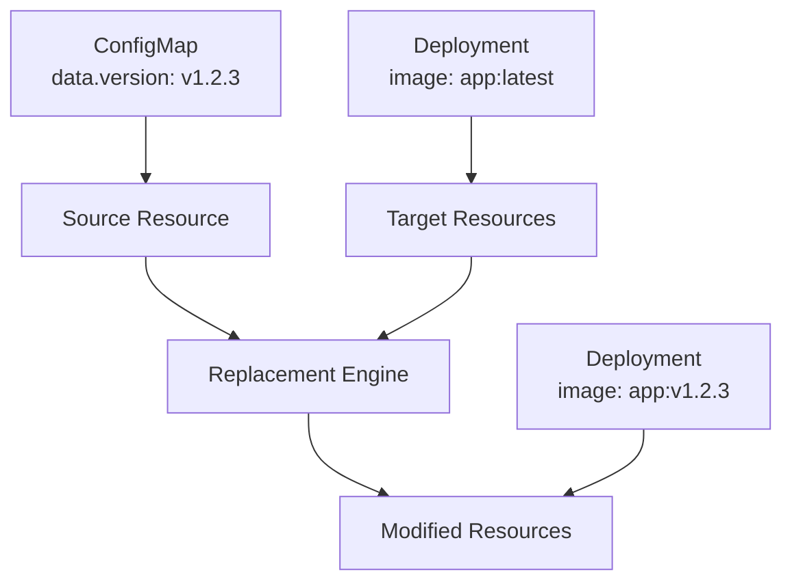

# Chapter 10: Advanced Features

## Learning Objectives

By the end of this chapter, you will be able to:
- Implement variable substitution and field replacements
- Integrate Helm charts with Kustomize workflows
- Create and use custom transformers and plugins
- Work with remote resources and Git repositories
- Use advanced field replacement patterns for complex configurations

## Variable Substitution and Replacements

Kustomize provides powerful variable substitution capabilities through the `replacements` feature, allowing dynamic configuration based on values from other resources.

### Understanding Replacements



### Basic Variable Substitution

**base/version-config.yaml**:
```yaml
apiVersion: v1
kind: ConfigMap
metadata:
  name: app-version
  labels:
    app: web-app
data:
  version: "v1.2.3"
  environment: "production"
  build: "20231201-abc123"
```

**base/deployment.yaml**:
```yaml
apiVersion: apps/v1
kind: Deployment
metadata:
  name: web-app
  labels:
    app: web-app
spec:
  replicas: 3
  selector:
    matchLabels:
      app: web-app
  template:
    metadata:
      labels:
        app: web-app
    spec:
      containers:
      - name: web-app
        image: registry.company.com/web-app:latest  # Will be replaced
        env:
        - name: APP_VERSION
          value: "unknown"  # Will be replaced
        - name: BUILD_ID
          value: "unknown"  # Will be replaced
```

**overlays/production/kustomization.yaml**:
```yaml
apiVersion: kustomize.config.k8s.io/v1beta1
kind: Kustomization

resources:
  - ../../base

# Variable substitution using replacements
replacements:
  # Replace image tag with version from ConfigMap
  - source:
      kind: ConfigMap
      name: app-version
      fieldPath: data.version
    targets:
      - select:
          kind: Deployment
          name: web-app
        fieldPaths:
          - spec.template.spec.containers.[name=web-app].image
        options:
          delimiter: ':'
          index: 1

  # Replace environment variable with version
  - source:
      kind: ConfigMap
      name: app-version
      fieldPath: data.version
    targets:
      - select:
          kind: Deployment
          name: web-app
        fieldPaths:
          - spec.template.spec.containers.[name=web-app].env.[name=APP_VERSION].value

  # Replace build ID
  - source:
      kind: ConfigMap
      name: app-version
      fieldPath: data.build
    targets:
      - select:
          kind: Deployment
          name: web-app
        fieldPaths:
          - spec.template.spec.containers.[name=web-app].env.[name=BUILD_ID].value
```

### Advanced Replacement Patterns

#### 1. Cross-Resource Field Copying

**overlays/advanced/kustomization.yaml**:
```yaml
apiVersion: kustomize.config.k8s.io/v1beta1
kind: Kustomization

resources:
  - ../../base

replacements:
  # Copy service name to deployment environment variable
  - source:
      kind: Service
      name: web-app
      fieldPath: metadata.name
    targets:
      - select:
          kind: Deployment
          name: web-app
        fieldPaths:
          - spec.template.spec.containers.[name=web-app].env.[name=SERVICE_NAME].value

  # Copy namespace to all resources
  - source:
      kind: Namespace
      name: app-namespace
      fieldPath: metadata.name
    targets:
      - select:
          kind: Deployment
        fieldPaths:
          - metadata.namespace
      - select:
          kind: Service
        fieldPaths:
          - metadata.namespace
```

#### 2. Complex Field Transformations

**overlays/complex/kustomization.yaml**:
```yaml
apiVersion: kustomize.config.k8s.io/v1beta1
kind: Kustomization

resources:
  - ../../base

replacements:
  # Extract hostname from full URL
  - source:
      kind: ConfigMap
      name: app-config
      fieldPath: data.database_url
    targets:
      - select:
          kind: Deployment
          name: web-app
        fieldPaths:
          - spec.template.spec.containers.[name=web-app].env.[name=DB_HOST].value
        options:
          delimiter: '@'
          index: 1

  # Generate resource names with prefix
  - source:
      kind: ConfigMap
      name: app-version
      fieldPath: data.environment
    targets:
      - select:
          kind: Deployment
          name: web-app
        fieldPaths:
          - metadata.name
        options:
          delimiter: '-'
          index: 0
```

## Helm Chart Integration

Kustomize can work with Helm charts, allowing you to leverage existing Helm charts while maintaining Kustomize workflows.

### Helm Chart as Remote Resource

**overlays/with-helm/kustomization.yaml**:
```yaml
apiVersion: kustomize.config.k8s.io/v1beta1
kind: Kustomization

# Include Helm chart as remote resource
resources:
  - https://github.com/prometheus-community/helm-charts/releases/download/prometheus-15.8.5/prometheus-15.8.5.tgz

# Apply Kustomize patches to Helm resources
patches:
  - patch: |
      apiVersion: apps/v1
      kind: Deployment
      metadata:
        name: prometheus-server
      spec:
        replicas: 2
        template:
          spec:
            containers:
            - name: prometheus-server
              resources:
                requests:
                  memory: "1Gi"
                  cpu: "500m"
                limits:
                  memory: "2Gi"
                  cpu: "1000m"

# Add Kustomize-specific labels
commonLabels:
  managed-by: kustomize
  chart-source: helm
```

### Local Helm Chart Integration

**charts/postgresql/kustomization.yaml**:
```yaml
apiVersion: kustomize.config.k8s.io/v1beta1
kind: Kustomization

# Use helmCharts to render Helm chart
helmCharts:
  - name: postgresql
    repo: https://charts.bitnami.com/bitnami
    version: 12.1.2
    releaseName: my-postgres
    namespace: database
    valuesInline:
      auth:
        postgresPassword: "secure-password"
        database: "myapp"
      primary:
        persistence:
          enabled: true
          size: 10Gi
      metrics:
        enabled: true

# Apply additional Kustomize configurations
commonLabels:
  app.kubernetes.io/managed-by: kustomize

patches:
  - patch: |
      apiVersion: v1
      kind: Service
      metadata:
        name: my-postgres-postgresql
        annotations:
          prometheus.io/scrape: "true"
          prometheus.io/port: "9187"
```

### Helm Chart with Custom Values

**overlays/helm-production/values.yaml**:
```yaml
# Custom Helm values
image:
  tag: "v2.0.0"

replicaCount: 3

resources:
  requests:
    memory: "512Mi"
    cpu: "250m"
  limits:
    memory: "1Gi"
    cpu: "500m"

ingress:
  enabled: true
  annotations:
    kubernetes.io/ingress.class: nginx
    cert-manager.io/cluster-issuer: letsencrypt-prod
  hosts:
    - host: app.company.com
      paths:
        - path: /
          pathType: Prefix
  tls:
    - secretName: app-tls
      hosts:
        - app.company.com

autoscaling:
  enabled: true
  minReplicas: 3
  maxReplicas: 100
  targetCPUUtilizationPercentage: 80
```

**overlays/helm-production/kustomization.yaml**:
```yaml
apiVersion: kustomize.config.k8s.io/v1beta1
kind: Kustomization

helmCharts:
  - name: web-app
    repo: https://charts.company.com/
    version: 1.0.0
    releaseName: production-web-app
    namespace: production
    valuesFile: values.yaml
    
# Post-process Helm output with Kustomize
patches:
  - patch: |
      apiVersion: networking.k8s.io/v1
      kind: Ingress
      metadata:
        name: production-web-app
        annotations:
          nginx.ingress.kubernetes.io/rate-limit: "100"
          nginx.ingress.kubernetes.io/ssl-redirect: "true"

configMapGenerator:
  - name: production-config
    literals:
      - ENVIRONMENT=production
      - LOG_LEVEL=warn
      - METRICS_ENABLED=true
```

## Custom Transformers and Plugins

Kustomize supports custom transformers and plugins for advanced use cases.

### Custom Transformer Example

**transformers/add-hash-suffix/transformer.yaml**:
```yaml
apiVersion: builtin
kind: HashTransformer
metadata:
  name: hash-transformer
```

**transformers/add-hash-suffix/kustomization.yaml**:
```yaml
apiVersion: kustomize.config.k8s.io/v1beta1
kind: Kustomization

transformers:
  - transformer.yaml

resources:
  - deployment.yaml
  - configmap.yaml
```

### Custom Plugin Development

**plugins/company.com/v1/environmentinjector/EnvironmentInjector**:
```bash
#!/bin/bash
# Custom plugin to inject environment-specific configurations

set -e

# Read input from stdin
input=$(cat)

# Get environment from plugin config
environment=$(echo "$input" | yq eval '.spec.environment' -)

# Apply environment-specific transformations
case $environment in
  "development")
    echo "$input" | yq eval '.spec.replicas = 1' - | \
    yq eval '.spec.template.spec.containers[0].resources.requests.memory = "128Mi"' -
    ;;
  "production")
    echo "$input" | yq eval '.spec.replicas = 5' - | \
    yq eval '.spec.template.spec.containers[0].resources.requests.memory = "512Mi"' -
    ;;
  *)
    echo "$input"
    ;;
esac
```

**plugins/company.com/v1/environmentinjector/kustomization.yaml**:
```yaml
apiVersion: kustomize.config.k8s.io/v1beta1
kind: Kustomization

generators:
  - plugin-config.yaml
```

**plugins/company.com/v1/environmentinjector/plugin-config.yaml**:
```yaml
apiVersion: company.com/v1
kind: EnvironmentInjector
metadata:
  name: env-injector
spec:
  environment: production
```

### KRM Functions Integration

**functions/set-namespace/kustomization.yaml**:
```yaml
apiVersion: kustomize.config.k8s.io/v1beta1
kind: Kustomization

resources:
  - ../../base

transformers:
  - set-namespace.yaml
```

**functions/set-namespace/set-namespace.yaml**:
```yaml
apiVersion: v1
kind: ConfigMap
metadata:
  name: set-namespace
  annotations:
    config.kubernetes.io/function: |
      container:
        image: gcr.io/kustomize-functions/set-namespace:v0.1.4
data:
  namespace: production
```

## Remote Resources and Git Integration

### Git Repository Resources

**overlays/with-remote/kustomization.yaml**:
```yaml
apiVersion: kustomize.config.k8s.io/v1beta1
kind: Kustomization

# Reference resources from Git repositories
resources:
  # Specific file from Git repo
  - https://github.com/company/k8s-configs/base/web-app/deployment.yaml?ref=v1.0.0
  
  # Entire directory from Git repo
  - github.com/company/shared-components/monitoring?ref=main
  
  # Private repository (requires authentication)
  - git::https://github.com/company/private-configs//base?ref=v2.1.0

# Local resources
  - deployment.yaml
  - service.yaml

# Apply patches to remote resources
patches:
  - patch: |
      apiVersion: apps/v1
      kind: Deployment
      metadata:
        name: web-app
      spec:
        replicas: 3
    target:
      kind: Deployment
      name: web-app
```

### Git Repository with Authentication

**.kustomize/auth/git-auth.yaml**:
```yaml
apiVersion: v1
kind: Secret
metadata:
  name: git-credentials
type: Opaque
data:
  username: base64-encoded-username
  password: base64-encoded-token
```

**kustomization.yaml**:
```yaml
apiVersion: kustomize.config.k8s.io/v1beta1
kind: Kustomization

resources:
  # Use authenticated Git access
  - git::https://github.com/company/private-configs//production?ref=v1.0.0

# Configure Git authentication
buildMetadata:
  - originAnnotations
  - transformerAnnotations
```

### Dynamic Resource Loading

**overlays/dynamic/kustomization.yaml**:
```yaml
apiVersion: kustomize.config.k8s.io/v1beta1
kind: Kustomization

# Load different resources based on environment
resources:
  - ../../base

# Environment-specific remote resources
replacements:
  - source:
      kind: ConfigMap
      name: environment-config
      fieldPath: data.environment
    targets:
      - select:
          kind: Kustomization
        fieldPaths:
          - resources
        options:
          create: true

configMapGenerator:
  - name: environment-config
    literals:
      - environment=${ENVIRONMENT:-development}
```

## Advanced Configuration Patterns

### 1. Multi-Cluster Configuration

**clusters/us-east-1/kustomization.yaml**:
```yaml
apiVersion: kustomize.config.k8s.io/v1beta1
kind: Kustomization

resources:
  - ../../base

# Cluster-specific configuration
configMapGenerator:
  - name: cluster-config
    literals:
      - CLUSTER_NAME=us-east-1
      - REGION=us-east-1
      - AVAILABILITY_ZONES=us-east-1a,us-east-1b,us-east-1c
      - STORAGE_CLASS=gp3

replacements:
  # Inject cluster-specific values
  - source:
      kind: ConfigMap
      name: cluster-config
      fieldPath: data.CLUSTER_NAME
    targets:
      - select:
          kind: Deployment
        fieldPaths:
          - spec.template.spec.containers.[name=app].env.[name=CLUSTER_NAME].value

  - source:
      kind: ConfigMap
      name: cluster-config
      fieldPath: data.STORAGE_CLASS
    targets:
      - select:
          kind: PersistentVolumeClaim
        fieldPaths:
          - spec.storageClassName
```

### 2. Feature Flag Management

**features/new-ui/kustomization.yaml**:
```yaml
apiVersion: kustomize.config.k8s.io/v1beta1
kind: Kustomization

# Feature flag component
commonLabels:
  feature.new-ui: "enabled"

configMapGenerator:
  - name: feature-flags
    literals:
      - NEW_UI_ENABLED=true
      - NEW_UI_VERSION=v2.0.0
      - ROLLOUT_PERCENTAGE=50

patches:
  - patch: |
      apiVersion: apps/v1
      kind: Deployment
      metadata:
        name: web-app
      spec:
        template:
          spec:
            containers:
            - name: web-app
              env:
              - name: NEW_UI_ENABLED
                valueFrom:
                  configMapKeyRef:
                    name: feature-flags
                    key: NEW_UI_ENABLED
              - name: ROLLOUT_PERCENTAGE
                valueFrom:
                  configMapKeyRef:
                    name: feature-flags
                    key: ROLLOUT_PERCENTAGE
```

### 3. Progressive Deployment Strategy

**deployment-strategies/canary/kustomization.yaml**:
```yaml
apiVersion: kustomize.config.k8s.io/v1beta1
kind: Kustomization

resources:
  - ../../base

# Canary deployment with Argo Rollouts
patches:
  - patch: |
      apiVersion: argoproj.io/v1alpha1
      kind: Rollout
      metadata:
        name: web-app
      spec:
        strategy:
          canary:
            steps:
            - setWeight: 10
            - pause: {}
            - setWeight: 50
            - pause: {duration: 30s}
            - setWeight: 100
            analysis:
              templates:
              - templateName: success-rate
              args:
              - name: service-name
                value: web-app
            trafficRouting:
              nginx:
                stableIngress: web-app
                additionalIngressAnnotations:
                  canary-by-header: X-Canary

# Replace Deployment with Rollout
replacements:
  - source:
      kind: Deployment
      name: web-app
      fieldPath: metadata.name
    targets:
      - select:
          kind: Rollout
          name: web-app
        fieldPaths:
          - metadata.name
```

## Performance Optimization

### 1. Build Optimization

**kustomization.yaml**:
```yaml
apiVersion: kustomize.config.k8s.io/v1beta1
kind: Kustomization

# Optimize build performance
buildMetadata:
  - managedByLabel
  - originAnnotations

# Reduce resource loading
resources:
  - deployment.yaml  # Only include necessary resources
  - service.yaml

# Efficient patch application
patches:
  - path: patches.yaml  # Combine multiple patches into one file

# Minimize generator usage
configMapGenerator:
  - name: app-config
    files:
      - config.properties  # Use files instead of many literals
```

### 2. Remote Resource Caching

**overlays/cached/kustomization.yaml**:
```yaml
apiVersion: kustomize.config.k8s.io/v1beta1
kind: Kustomization

# Use specific versions to enable caching
resources:
  - github.com/company/shared-configs/base?ref=v1.2.3  # Specific version
  - https://raw.githubusercontent.com/company/configs/v1.2.3/base.yaml  # Direct file with version

# Avoid latest/main references for better caching
# - github.com/company/shared-configs/base?ref=main  # Avoid this
```

## Error Handling and Validation

### 1. Configuration Validation

**validation/validate.sh**:
```bash
#!/bin/bash
# Validation script for advanced configurations

set -e

echo "Validating advanced Kustomize configuration..."

# Check for required environment variables
if [[ -z "$ENVIRONMENT" ]]; then
    echo "Error: ENVIRONMENT variable not set"
    exit 1
fi

# Validate replacement sources exist
kustomize build . --dry-run > /tmp/output.yaml

# Check for required labels
if ! grep -q "app.kubernetes.io/name" /tmp/output.yaml; then
    echo "Warning: Missing standard labels"
fi

# Validate resource limits
if ! grep -q "resources:" /tmp/output.yaml; then
    echo "Warning: No resource limits specified"
fi

# Check for security context
if ! grep -q "securityContext:" /tmp/output.yaml; then
    echo "Warning: No security context specified"
fi

echo "Validation complete!"
```

### 2. Advanced Testing

**tests/integration-test.yaml**:
```yaml
apiVersion: kustomize.config.k8s.io/v1beta1
kind: Kustomization

resources:
  - ../overlays/production

# Test-specific configurations
configMapGenerator:
  - name: test-config
    literals:
      - TEST_MODE=true
      - MOCK_EXTERNAL_SERVICES=true

patches:
  - patch: |
      apiVersion: apps/v1
      kind: Deployment
      metadata:
        name: web-app
      spec:
        replicas: 1  # Single replica for testing
        template:
          spec:
            containers:
            - name: web-app
              env:
              - name: TEST_MODE
                value: "true"
```

## Chapter Summary

In this chapter, we explored advanced Kustomize features:

### Key Concepts Mastered
- **Variable Substitution**: Dynamic field replacement using the replacements feature
- **Helm Integration**: Combining Helm charts with Kustomize workflows
- **Custom Transformers**: Creating custom plugins and transformers for specific needs
- **Remote Resources**: Working with Git repositories and external resources
- **Advanced Patterns**: Multi-cluster, feature flags, and progressive deployment strategies

### Practical Skills Developed
- Implementing complex field replacement patterns
- Integrating existing Helm charts into Kustomize workflows
- Creating custom transformers and plugins
- Managing remote resources with version control
- Optimizing build performance and validation

### Advanced Use Cases Addressed
- **Multi-cluster deployments** with cluster-specific configurations
- **Feature flag management** for gradual feature rollouts
- **Progressive deployment strategies** with canary and blue-green patterns
- **Complex field transformations** for dynamic configuration
- **Performance optimization** for large-scale deployments

### Best Practices Learned
- Use specific versions for remote resources to enable caching
- Combine related patches to improve build performance
- Validate configurations with automated testing
- Document complex replacement patterns
- Design transformers to be reusable across projects

These advanced features enable sophisticated deployment patterns while maintaining the declarative, composable nature of Kustomize configurations.

---

**Next**: [Chapter 11: CI/CD Integration](11-cicd-integration.md)

**Previous**: [Chapter 9: Components and Reusability](09-components-reusability.md)

**Quick Links**: [Table of Contents](../README.md) | [Examples](../examples/chapter-10/)