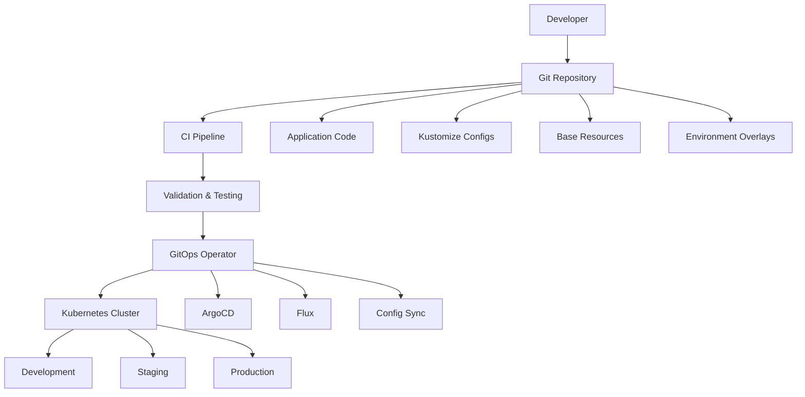

# Chapter 11: CI/CD Integration

## Learning Objectives

By the end of this chapter, you will be able to:
- Implement GitOps workflows using Kustomize with ArgoCD and Flux
- Set up automated testing and validation pipelines for Kustomize configurations
- Create promotion pipelines across environments
- Integrate Kustomize with popular CI/CD platforms (GitHub Actions, GitLab CI, Jenkins)
- Implement security scanning and compliance checks in CI/CD pipelines

## GitOps with Kustomize

GitOps represents a paradigm where Git repositories serve as the single source of truth for declarative infrastructure and applications, with automated systems ensuring the live environment matches the desired state described in Git.

### GitOps Architecture with Kustomize



### GitOps Repository Structure

```
gitops-repo/
├── applications/
│   ├── web-app/
│   │   ├── base/
│   │   │   ├── kustomization.yaml
│   │   │   ├── deployment.yaml
│   │   │   └── service.yaml
│   │   └── overlays/
│   │       ├── development/
│   │       ├── staging/
│   │       └── production/
│   └── api-service/
├── infrastructure/
│   ├── ingress-controller/
│   ├── monitoring/
│   └── security/
├── clusters/
│   ├── development/
│   ├── staging/
│   └── production/
└── .github/
    └── workflows/
```

## ArgoCD Integration

ArgoCD is a declarative GitOps continuous delivery tool for Kubernetes that works exceptionally well with Kustomize.

### ArgoCD Application Configuration

**argocd/applications/web-app-dev.yaml**:
```yaml
apiVersion: argoproj.io/v1alpha1
kind: Application
metadata:
  name: web-app-development
  namespace: argocd
  labels:
    app: web-app
    environment: development
spec:
  project: default
  source:
    repoURL: https://github.com/company/gitops-repo
    targetRevision: main
    path: applications/web-app/overlays/development
  destination:
    server: https://kubernetes.default.svc
    namespace: web-app-dev
  syncPolicy:
    automated:
      prune: true
      selfHeal: true
      allowEmpty: false
    syncOptions:
    - CreateNamespace=true
    - PrunePropagationPolicy=foreground
    - PruneLast=true
    retry:
      limit: 5
      backoff:
        duration: 5s
        factor: 2
        maxDuration: 3m
  revisionHistoryLimit: 10
```

**argocd/applications/web-app-prod.yaml**:
```yaml
apiVersion: argoproj.io/v1alpha1
kind: Application
metadata:
  name: web-app-production
  namespace: argocd
  labels:
    app: web-app
    environment: production
spec:
  project: production
  source:
    repoURL: https://github.com/company/gitops-repo
    targetRevision: production  # Use production branch
    path: applications/web-app/overlays/production
  destination:
    server: https://prod-cluster.company.com
    namespace: web-app-prod
  syncPolicy:
    automated:
      prune: false  # Manual pruning for production
      selfHeal: false  # Manual sync for production
    syncOptions:
    - CreateNamespace=true
    - PrunePropagationPolicy=foreground
  revisionHistoryLimit: 50
```

### ArgoCD App of Apps Pattern

**argocd/app-of-apps/kustomization.yaml**:
```yaml
apiVersion: kustomize.config.k8s.io/v1beta1
kind: Kustomization

resources:
  - web-app-dev.yaml
  - web-app-staging.yaml
  - web-app-prod.yaml
  - api-service-dev.yaml
  - api-service-prod.yaml

commonLabels:
  managed-by: argocd
  
# Environment-specific configurations
patches:
  - target:
      kind: Application
      labelSelector: environment=development
    patch: |
      - op: replace
        path: /spec/syncPolicy/automated/prune
        value: true
      - op: replace
        path: /spec/syncPolicy/automated/selfHeal
        value: true
  
  - target:
      kind: Application
      labelSelector: environment=production
    patch: |
      - op: replace
        path: /spec/syncPolicy/automated/prune
        value: false
      - op: replace
        path: /spec/syncPolicy/automated/selfHeal
        value: false
```

### ArgoCD ApplicationSet for Multi-Environment

**argocd/applicationsets/web-app.yaml**:
```yaml
apiVersion: argoproj.io/v1alpha1
kind: ApplicationSet
metadata:
  name: web-app-environments
  namespace: argocd
spec:
  generators:
  - list:
      elements:
      - environment: development
        cluster: https://kubernetes.default.svc
        namespace: web-app-dev
        autoSync: true
        branch: main
      - environment: staging
        cluster: https://staging-cluster.company.com
        namespace: web-app-staging
        autoSync: true
        branch: main
      - environment: production
        cluster: https://prod-cluster.company.com
        namespace: web-app-prod
        autoSync: false
        branch: production
  
  template:
    metadata:
      name: 'web-app-{{environment}}'
      labels:
        app: web-app
        environment: '{{environment}}'
    spec:
      project: default
      source:
        repoURL: https://github.com/company/gitops-repo
        targetRevision: '{{branch}}'
        path: 'applications/web-app/overlays/{{environment}}'
      destination:
        server: '{{cluster}}'
        namespace: '{{namespace}}'
      syncPolicy:
        automated:
          prune: '{{autoSync}}'
          selfHeal: '{{autoSync}}'
        syncOptions:
        - CreateNamespace=true
```

## Flux Integration

Flux v2 provides another excellent GitOps solution that integrates seamlessly with Kustomize.

### Flux Kustomization Resource

**flux/clusters/development/web-app.yaml**:
```yaml
apiVersion: kustomize.toolkit.fluxcd.io/v1beta2
kind: Kustomization
metadata:
  name: web-app-development
  namespace: flux-system
spec:
  interval: 10m
  retryInterval: 2m
  timeout: 5m
  
  sourceRef:
    kind: GitRepository
    name: gitops-repo
  
  path: "./applications/web-app/overlays/development"
  
  prune: true
  wait: true
  
  targetNamespace: web-app-dev
  
  dependsOn:
    - name: infrastructure
    - name: monitoring

---
apiVersion: source.toolkit.fluxcd.io/v1beta2
kind: GitRepository
metadata:
  name: gitops-repo
  namespace: flux-system
spec:
  interval: 5m
  url: https://github.com/company/gitops-repo
  ref:
    branch: main
  secretRef:
    name: git-credentials
```

### Flux Multi-Source Configuration

**flux/clusters/production/web-app.yaml**:
```yaml
apiVersion: kustomize.toolkit.fluxcd.io/v1beta2
kind: Kustomization
metadata:
  name: web-app-production
  namespace: flux-system
spec:
  interval: 30m  # Less frequent for production
  retryInterval: 5m
  timeout: 10m
  
  sourceRef:
    kind: GitRepository
    name: gitops-repo
    branch: production
  
  path: "./applications/web-app/overlays/production"
  
  prune: false  # Manual pruning for production
  wait: true
  
  targetNamespace: web-app-prod
  
  # Production-specific health checks
  healthChecks:
    - apiVersion: apps/v1
      kind: Deployment
      name: web-app
      namespace: web-app-prod
  
  # Suspend for manual approval
  suspend: false
  
  dependsOn:
    - name: production-infrastructure
    - name: production-monitoring
    - name: production-security
```

## GitHub Actions Integration

### Complete CI/CD Pipeline

**.github/workflows/ci-cd.yaml**:
```yaml
name: CI/CD Pipeline

on:
  push:
    branches: [ main, develop ]
    paths:
    - 'applications/**'
    - '.github/workflows/**'
  
  pull_request:
    branches: [ main ]
    paths:
    - 'applications/**'

env:
  REGISTRY: ghcr.io
  IMAGE_NAME: ${{ github.repository }}

jobs:
  validate:
    name: Validate Kustomize Configurations
    runs-on: ubuntu-latest
    
    steps:
    - name: Checkout code
      uses: actions/checkout@v4
    
    - name: Install Kustomize
      run: |
        curl -s "https://raw.githubusercontent.com/kubernetes-sigs/kustomize/master/hack/install_kustomize.sh" | bash
        sudo mv kustomize /usr/local/bin/
    
    - name: Install kubectl
      uses: azure/setup-kubectl@v3
      with:
        version: 'v1.28.0'
    
    - name: Validate all overlays
      run: |
        for overlay in applications/*/overlays/*/; do
          echo "Validating $overlay"
          kustomize build "$overlay" > /dev/null
          echo "✓ $overlay is valid"
        done
    
    - name: Validate against Kubernetes API
      run: |
        for overlay in applications/*/overlays/*/; do
          echo "Validating $overlay against Kubernetes API"
          kustomize build "$overlay" | kubectl apply --dry-run=client -f -
        done
    
    - name: Security scan with Polaris
      run: |
        curl -L https://github.com/FairwindsOps/polaris/releases/latest/download/polaris_linux_amd64.tar.gz | tar xz
        sudo mv polaris /usr/local/bin/
        
        for overlay in applications/*/overlays/production/; do
          echo "Security scanning $overlay"
          kustomize build "$overlay" | polaris audit --audit-path - --format json > polaris-report.json
          
          # Check for high severity issues
          if jq '.Results[] | select(.Severity == "error")' polaris-report.json | grep -q .; then
            echo "❌ Security issues found in $overlay"
            jq '.Results[] | select(.Severity == "error")' polaris-report.json
            exit 1
          fi
        done

  test:
    name: Test Applications
    runs-on: ubuntu-latest
    needs: validate
    
    steps:
    - name: Checkout code
      uses: actions/checkout@v4
    
    - name: Start minikube
      uses: medyagh/setup-minikube@master
      with:
        minikube-version: 1.31.0
        kubernetes-version: 1.28.0
    
    - name: Install Kustomize
      run: |
        curl -s "https://raw.githubusercontent.com/kubernetes-sigs/kustomize/master/hack/install_kustomize.sh" | bash
        sudo mv kustomize /usr/local/bin/
    
    - name: Deploy to test environment
      run: |
        # Deploy application
        kubectl apply -k applications/web-app/overlays/development/
        
        # Wait for deployment
        kubectl rollout status deployment/web-app -n web-app-dev --timeout=300s
        
        # Run health checks
        kubectl get pods -n web-app-dev
        
        # Test application endpoints
        kubectl port-forward -n web-app-dev service/web-app 8080:80 &
        sleep 10
        curl -f http://localhost:8080/health || exit 1
    
    - name: Cleanup
      if: always()
      run: |
        kubectl delete -k applications/web-app/overlays/development/ --ignore-not-found=true

  build:
    name: Build and Push Image
    runs-on: ubuntu-latest
    needs: test
    if: github.ref == 'refs/heads/main'
    
    outputs:
      image-tag: ${{ steps.meta.outputs.tags }}
      image-digest: ${{ steps.build.outputs.digest }}
    
    steps:
    - name: Checkout code
      uses: actions/checkout@v4
    
    - name: Log in to Container Registry
      uses: docker/login-action@v3
      with:
        registry: ${{ env.REGISTRY }}
        username: ${{ github.actor }}
        password: ${{ secrets.GITHUB_TOKEN }}
    
    - name: Extract metadata
      id: meta
      uses: docker/metadata-action@v5
      with:
        images: ${{ env.REGISTRY }}/${{ env.IMAGE_NAME }}
        tags: |
          type=ref,event=branch
          type=ref,event=pr
          type=sha,prefix=main-
    
    - name: Build and push Docker image
      id: build
      uses: docker/build-push-action@v5
      with:
        context: .
        file: ./applications/web-app/Dockerfile
        push: true
        tags: ${{ steps.meta.outputs.tags }}
        labels: ${{ steps.meta.outputs.labels }}

  update-manifests:
    name: Update Manifests
    runs-on: ubuntu-latest
    needs: build
    if: github.ref == 'refs/heads/main'
    
    steps:
    - name: Checkout code
      uses: actions/checkout@v4
      with:
        token: ${{ secrets.GITOPS_TOKEN }}
    
    - name: Install Kustomize
      run: |
        curl -s "https://raw.githubusercontent.com/kubernetes-sigs/kustomize/master/hack/install_kustomize.sh" | bash
        sudo mv kustomize /usr/local/bin/
    
    - name: Update image tag
      run: |
        cd applications/web-app/overlays/development
        kustomize edit set image web-app=${{ needs.build.outputs.image-tag }}
        
        cd ../staging
        kustomize edit set image web-app=${{ needs.build.outputs.image-tag }}
    
    - name: Commit and push changes
      run: |
        git config --local user.email "action@github.com"
        git config --local user.name "GitHub Action"
        git add applications/web-app/overlays/
        git commit -m "Update image to ${{ needs.build.outputs.image-tag }}" || exit 0
        git push

  deploy-production:
    name: Deploy to Production
    runs-on: ubuntu-latest
    needs: [build, update-manifests]
    if: github.ref == 'refs/heads/main'
    environment: production
    
    steps:
    - name: Checkout code
      uses: actions/checkout@v4
      with:
        token: ${{ secrets.GITOPS_TOKEN }}
        ref: production
    
    - name: Install Kustomize
      run: |
        curl -s "https://raw.githubusercontent.com/kubernetes-sigs/kustomize/master/hack/install_kustomize.sh" | bash
        sudo mv kustomize /usr/local/bin/
    
    - name: Update production manifest
      run: |
        cd applications/web-app/overlays/production
        kustomize edit set image web-app=${{ needs.build.outputs.image-tag }}
    
    - name: Commit production changes
      run: |
        git config --local user.email "action@github.com"
        git config --local user.name "GitHub Action"
        git add applications/web-app/overlays/production/
        git commit -m "Deploy ${{ needs.build.outputs.image-tag }} to production"
        git push origin production
```

### Pull Request Validation

**.github/workflows/pr-validation.yaml**:
```yaml
name: PR Validation

on:
  pull_request:
    branches: [ main ]
    paths:
    - 'applications/**'

jobs:
  validate-changes:
    name: Validate Changes
    runs-on: ubuntu-latest
    
    steps:
    - name: Checkout PR
      uses: actions/checkout@v4
    
    - name: Checkout base branch
      uses: actions/checkout@v4
      with:
        ref: main
        path: base
    
    - name: Install tools
      run: |
        curl -s "https://raw.githubusercontent.com/kubernetes-sigs/kustomize/master/hack/install_kustomize.sh" | bash
        sudo mv kustomize /usr/local/bin/
        curl -L https://github.com/mikefarah/yq/releases/latest/download/yq_linux_amd64 -o yq
        sudo mv yq /usr/local/bin/ && sudo chmod +x /usr/local/bin/yq
    
    - name: Show configuration differences
      run: |
        echo "## Configuration Changes" >> $GITHUB_STEP_SUMMARY
        
        for overlay in applications/*/overlays/*/; do
          if [ -d "base/$overlay" ]; then
            echo "### Changes in $overlay" >> $GITHUB_STEP_SUMMARY
            echo '```diff' >> $GITHUB_STEP_SUMMARY
            
            # Build configurations and show diff
            kustomize build "$overlay" > pr-config.yaml
            kustomize build "base/$overlay" > base-config.yaml
            diff -u base-config.yaml pr-config.yaml >> $GITHUB_STEP_SUMMARY || true
            
            echo '```' >> $GITHUB_STEP_SUMMARY
          fi
        done
    
    - name: Validate resource quotas
      run: |
        for overlay in applications/*/overlays/production/; do
          echo "Checking resource limits for $overlay"
          
          # Extract resource requests
          kustomize build "$overlay" | yq eval 'select(.kind == "Deployment") | .spec.template.spec.containers[].resources.requests' -
          
          # Check if production has resource limits
          if ! kustomize build "$overlay" | grep -q "limits:"; then
            echo "❌ Production overlay missing resource limits"
            exit 1
          fi
        done
```

## GitLab CI Integration

**.gitlab-ci.yml**:
```yaml
stages:
  - validate
  - test
  - build
  - deploy-dev
  - deploy-staging
  - deploy-prod

variables:
  DOCKER_TLS_CERTDIR: "/certs"
  KUSTOMIZE_VERSION: "5.0.0"

before_script:
  - curl -s "https://raw.githubusercontent.com/kubernetes-sigs/kustomize/master/hack/install_kustomize.sh" | bash
  - sudo mv kustomize /usr/local/bin/
  - apk add --no-cache curl

validate:
  stage: validate
  image: alpine:latest
  script:
    - |
      for overlay in applications/*/overlays/*/; do
        echo "Validating $overlay"
        kustomize build "$overlay" > /dev/null
      done
  rules:
    - changes:
      - applications/**/*

security-scan:
  stage: validate
  image: alpine:latest
  script:
    - |
      curl -L https://github.com/FairwindsOps/polaris/releases/latest/download/polaris_linux_amd64.tar.gz | tar xz
      sudo mv polaris /usr/local/bin/
      
      for overlay in applications/*/overlays/production/; do
        kustomize build "$overlay" | polaris audit --audit-path - --format json > polaris-report.json
        if jq '.Results[] | select(.Severity == "error")' polaris-report.json | grep -q .; then
          echo "Security issues found"
          exit 1
        fi
      done
  artifacts:
    reports:
      security: polaris-report.json

build:
  stage: build
  image: docker:latest
  services:
    - docker:dind
  script:
    - docker build -t $CI_REGISTRY_IMAGE:$CI_COMMIT_SHA .
    - docker push $CI_REGISTRY_IMAGE:$CI_COMMIT_SHA
  only:
    - main

deploy-development:
  stage: deploy-dev
  image: alpine:latest
  script:
    - |
      cd applications/web-app/overlays/development
      kustomize edit set image web-app=$CI_REGISTRY_IMAGE:$CI_COMMIT_SHA
      kustomize build . | kubectl apply -f -
  environment:
    name: development
    url: https://dev.company.com
  only:
    - main

deploy-staging:
  stage: deploy-staging
  image: alpine:latest
  script:
    - |
      cd applications/web-app/overlays/staging
      kustomize edit set image web-app=$CI_REGISTRY_IMAGE:$CI_COMMIT_SHA
      kustomize build . | kubectl apply -f -
  environment:
    name: staging
    url: https://staging.company.com
  when: manual
  only:
    - main

deploy-production:
  stage: deploy-prod
  image: alpine:latest
  script:
    - |
      cd applications/web-app/overlays/production
      kustomize edit set image web-app=$CI_REGISTRY_IMAGE:$CI_COMMIT_SHA
      kustomize build . | kubectl apply -f -
  environment:
    name: production
    url: https://company.com
  when: manual
  only:
    - main
  rules:
    - if: $CI_COMMIT_BRANCH == "main"
      when: manual
      allow_failure: false
```

## Jenkins Pipeline Integration

**Jenkinsfile**:
```groovy
pipeline {
    agent any
    
    environment {
        REGISTRY = 'registry.company.com'
        IMAGE_NAME = 'web-app'
        KUSTOMIZE_VERSION = '5.0.0'
    }
    
    stages {
        stage('Setup') {
            steps {
                script {
                    sh '''
                        curl -s "https://raw.githubusercontent.com/kubernetes-sigs/kustomize/master/hack/install_kustomize.sh" | bash
                        sudo mv kustomize /usr/local/bin/
                        kustomize version
                    '''
                }
            }
        }
        
        stage('Validate') {
            parallel {
                stage('Kustomize Validation') {
                    steps {
                        script {
                            sh '''
                                for overlay in applications/*/overlays/*/; do
                                    echo "Validating $overlay"
                                    kustomize build "$overlay" > /dev/null
                                done
                            '''
                        }
                    }
                }
                
                stage('Security Scan') {
                    steps {
                        script {
                            sh '''
                                curl -L https://github.com/FairwindsOps/polaris/releases/latest/download/polaris_linux_amd64.tar.gz | tar xz
                                sudo mv polaris /usr/local/bin/
                                
                                for overlay in applications/*/overlays/production/; do
                                    kustomize build "$overlay" | polaris audit --audit-path - --format json > polaris-report.json
                                done
                            '''
                        }
                        publishHTML([
                            allowMissing: false,
                            alwaysLinkToLastBuild: true,
                            keepAll: true,
                            reportDir: '.',
                            reportFiles: 'polaris-report.json',
                            reportName: 'Security Report'
                        ])
                    }
                }
            }
        }
        
        stage('Build') {
            when {
                branch 'main'
            }
            steps {
                script {
                    def image = docker.build("${REGISTRY}/${IMAGE_NAME}:${BUILD_NUMBER}")
                    docker.withRegistry("https://${REGISTRY}", 'registry-credentials') {
                        image.push()
                        image.push('latest')
                    }
                }
            }
        }
        
        stage('Deploy to Development') {
            when {
                branch 'main'
            }
            steps {
                script {
                    sh '''
                        cd applications/web-app/overlays/development
                        kustomize edit set image web-app=${REGISTRY}/${IMAGE_NAME}:${BUILD_NUMBER}
                        kustomize build . | kubectl apply -f -
                    '''
                }
            }
        }
        
        stage('Deploy to Staging') {
            when {
                branch 'main'
            }
            steps {
                script {
                    input message: 'Deploy to staging?', ok: 'Deploy'
                    sh '''
                        cd applications/web-app/overlays/staging
                        kustomize edit set image web-app=${REGISTRY}/${IMAGE_NAME}:${BUILD_NUMBER}
                        kustomize build . | kubectl apply -f -
                    '''
                }
            }
        }
        
        stage('Deploy to Production') {
            when {
                branch 'main'
            }
            steps {
                script {
                    input message: 'Deploy to production?', ok: 'Deploy',
                          submitterParameter: 'DEPLOYER'
                    
                    sh '''
                        cd applications/web-app/overlays/production
                        kustomize edit set image web-app=${REGISTRY}/${IMAGE_NAME}:${BUILD_NUMBER}
                        kustomize build . | kubectl apply -f -
                    '''
                    
                    // Record deployment
                    sh '''
                        echo "Deployed by: ${DEPLOYER}" >> deployment-log.txt
                        echo "Image: ${REGISTRY}/${IMAGE_NAME}:${BUILD_NUMBER}" >> deployment-log.txt
                        echo "Time: $(date)" >> deployment-log.txt
                    '''
                }
            }
        }
    }
    
    post {
        always {
            cleanWs()
        }
        
        failure {
            emailext (
                subject: "Pipeline Failed: ${env.JOB_NAME} - ${env.BUILD_NUMBER}",
                body: "Pipeline failed. Check console output at ${env.BUILD_URL}",
                to: "${env.CHANGE_AUTHOR_EMAIL}"
            )
        }
        
        success {
            script {
                if (env.BRANCH_NAME == 'main') {
                    slackSend (
                        color: 'good',
                        message: "✅ Deployment successful: ${env.JOB_NAME} - ${env.BUILD_NUMBER}"
                    )
                }
            }
        }
    }
}
```

## Advanced CI/CD Patterns

### Progressive Deployment with Canary

**deployment-strategies/canary/github-actions.yaml**:
```yaml
name: Canary Deployment

on:
  workflow_call:
    inputs:
      environment:
        required: true
        type: string
      image-tag:
        required: true
        type: string
      canary-percentage:
        required: false
        type: number
        default: 10

jobs:
  canary-deploy:
    name: Canary Deployment
    runs-on: ubuntu-latest
    
    steps:
    - name: Checkout code
      uses: actions/checkout@v4
    
    - name: Deploy canary
      run: |
        # Update canary overlay
        cd applications/web-app/overlays/${{ inputs.environment }}-canary
        kustomize edit set image web-app=${{ inputs.image-tag }}
        
        # Set canary weight
        yq eval ".spec.strategy.canary.steps[0].setWeight = ${{ inputs.canary-percentage }}" -i rollout.yaml
        
        # Apply canary
        kustomize build . | kubectl apply -f -
    
    - name: Wait for canary analysis
      run: |
        kubectl argo rollouts get rollout web-app -n ${{ inputs.environment }} --watch
    
    - name: Promote or rollback
      run: |
        # Check canary metrics
        CANARY_SUCCESS=$(kubectl argo rollouts status web-app -n ${{ inputs.environment }})
        
        if [[ "$CANARY_SUCCESS" == *"Healthy"* ]]; then
          echo "Canary successful, promoting..."
          kubectl argo rollouts promote web-app -n ${{ inputs.environment }}
        else
          echo "Canary failed, rolling back..."
          kubectl argo rollouts abort web-app -n ${{ inputs.environment }}
          exit 1
        fi
```

### Blue-Green Deployment

**deployment-strategies/blue-green/kustomization.yaml**:
```yaml
apiVersion: kustomize.config.k8s.io/v1beta1
kind: Kustomization

resources:
  - ../../base

patches:
  - patch: |
      apiVersion: argoproj.io/v1alpha1
      kind: Rollout
      metadata:
        name: web-app
      spec:
        strategy:
          blueGreen:
            activeService: web-app-active
            previewService: web-app-preview
            autoPromotionEnabled: false
            scaleDownDelaySeconds: 30
            prePromotionAnalysis:
              templates:
              - templateName: success-rate
              args:
              - name: service-name
                value: web-app-preview
            postPromotionAnalysis:
              templates:
              - templateName: success-rate
              args:
              - name: service-name
                value: web-app-active

  - patch: |
      apiVersion: v1
      kind: Service
      metadata:
        name: web-app-active
      spec:
        selector:
          app: web-app

  - patch: |
      apiVersion: v1
      kind: Service
      metadata:
        name: web-app-preview
      spec:
        selector:
          app: web-app
```

## Monitoring and Observability

### Pipeline Metrics Collection

**monitoring/pipeline-metrics.yaml**:
```yaml
apiVersion: v1
kind: ServiceMonitor
metadata:
  name: ci-cd-metrics
spec:
  selector:
    matchLabels:
      app: ci-cd-pipeline
  endpoints:
  - port: metrics
    path: /metrics
    interval: 30s

---
apiVersion: monitoring.coreos.com/v1
kind: PrometheusRule
metadata:
  name: ci-cd-alerts
spec:
  groups:
  - name: ci-cd.rules
    rules:
    - alert: DeploymentFailure
      expr: increase(ci_cd_deployment_failures_total[5m]) > 0
      for: 0m
      labels:
        severity: critical
      annotations:
        summary: "Deployment failure detected"
        description: "Deployment to {{ $labels.environment }} has failed"
    
    - alert: LongDeploymentTime
      expr: ci_cd_deployment_duration_seconds > 600
      for: 0m
      labels:
        severity: warning
      annotations:
        summary: "Deployment taking too long"
        description: "Deployment to {{ $labels.environment }} is taking over 10 minutes"
```

### GitOps Drift Detection

**monitoring/drift-detection.yaml**:
```yaml
apiVersion: batch/v1
kind: CronJob
metadata:
  name: gitops-drift-detector
spec:
  schedule: "*/10 * * * *"  # Every 10 minutes
  jobTemplate:
    spec:
      template:
        spec:
          containers:
          - name: drift-detector
            image: alpine/git:latest
            command:
            - /bin/sh
            - -c
            - |
              # Compare live state with Git state
              kubectl get all -n web-app-prod -o yaml > live-state.yaml
              
              git clone https://github.com/company/gitops-repo.git
              cd gitops-repo
              kustomize build applications/web-app/overlays/production > git-state.yaml
              
              # Check for drift
              if ! diff live-state.yaml git-state.yaml > /dev/null; then
                echo "Drift detected in production environment!"
                # Send alert to monitoring system
                curl -X POST "$WEBHOOK_URL" -d '{"text": "GitOps drift detected in production"}'
              fi
          restartPolicy: OnFailure
```

## Chapter Summary

In this chapter, we explored comprehensive CI/CD integration with Kustomize:

### Key Concepts Mastered
- **GitOps Workflows**: Implementing declarative deployments with ArgoCD and Flux
- **CI/CD Platforms**: Integration with GitHub Actions, GitLab CI, and Jenkins
- **Progressive Deployment**: Canary and blue-green deployment strategies
- **Automated Testing**: Validation, security scanning, and integration testing

### Practical Skills Developed
- Setting up complete CI/CD pipelines with Kustomize
- Implementing GitOps patterns with popular tools
- Creating automated promotion workflows
- Monitoring and alerting for deployment pipelines
- Implementing security scanning and compliance checks

### Advanced Patterns Implemented
- **Multi-environment promotion** with automated and manual gates
- **Security-first pipelines** with integrated scanning and validation
- **Drift detection** and reconciliation mechanisms
- **Progressive deployment strategies** for risk mitigation
- **Comprehensive monitoring** and observability

### Best Practices Learned
- Separate application code from configuration repositories
- Implement proper branch protection and approval workflows
- Use environment-specific namespaces and clusters
- Automate testing and validation at every stage
- Monitor deployment metrics and set up alerting
- Implement proper secret management and security scanning

### Pipeline Benefits Achieved
- **Reduced deployment risk** through automated testing and progressive deployments
- **Faster feedback cycles** with integrated validation and testing
- **Improved collaboration** between development and operations teams
- **Enhanced security** through automated scanning and compliance checks
- **Better visibility** into deployment status and health

This foundation enables teams to implement robust, secure, and efficient CI/CD pipelines that leverage Kustomize's declarative configuration management while maintaining high deployment velocity and reliability.

---

**Next**: [Chapter 12: Best Practices and Production](12-best-practices.md)

**Previous**: [Chapter 10: Advanced Features](10-advanced-features.md)

**Quick Links**: [Table of Contents](../README.md) | [Examples](../examples/chapter-11/)